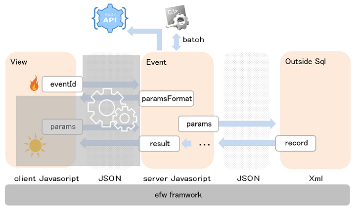
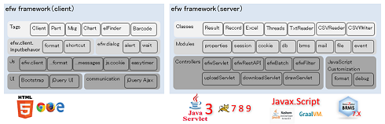

<H1>efw4.X</H1>
<!--
<h3>What's new?</h3>
<h4>Added</h4>
i18n:	Multi Language <a href="help/api_language.md">Resource</a>.	Multi Language Folder in <a href="help/files_list.md">Files List</a>.	Attribute "lang" in <a href="help/tag.client.md">Client tag</a>.	<a href="help/tag.msg.md">Message Tag</a> in JSP.	{Message Key} in <a href="help/api_webevent.md">Web Event</a>. 
ui:	Attribute "mode" and "theme" in <a href="help/tag.client.md">Client tag</a>. Attribute "mode" in <a href="help/tag.chart.md">Chart tag</a>. 
RestAPI:	<a href="help/api_restevent.md">Rest Event</a>.

<h4>Removed</h4>
Additional Tags:	Signature,	CKEditor
<h4>Updated</h4>
jdk:	java jdk1.8 or later or graalvm. 
poi:	poi 4.1.1  4.1.2  5.1.0 
zxing:	zxing 3.4. 
<h4>Changed</h4>
file.readAllLines:	Add "encoding" param. Remove charset auto detecting. So juniversalchardet-1.0.3.jar is not necessary. 
elFinder:	Remove get command and the plain text editor.Add session-check for security safe. 
Barcode:	Move barcode in Additional Tags.
-->
<h3>Introduction</h3>
<table><tr><td></td>
<td colspan=2></td></tr></table>
<a href="https://efwgrp.github.io/efw4_online_ppt/EFW紹介v2.0/index.html">EFW紹介</a>, 
<a href="https://efwgrp.github.io/efw4_online_ppt/EFWとMVCの比較v0.1/index.html">MVCと比較</a> 
<a href="https://efwgrp.github.io/efw4_online_ppt/EFWプログラミングv1.4/index.html">EFWプログラミング</a>, 
<a href="https://efwgrp.github.io/efw4_online_ppt/EFWサンプルSkeletonのデザイン説明v0.3/index.html">サンプルSkeletonのデザイン説明</a> 
<a href="https://efwgrp.github.io/efw4_online_ppt/EFWセキュリティ関連v0.2/index.html">セキュリティ関連</a>, 
<a href="https://efwgrp.github.io/efw4_online_ppt/EFW高負荷対応のTomcat環境構築v0.4/index.html">高負荷対応のTomcat環境構築</a> 
<a href="help/environment.md">Environment</a>, <a href="help/files_list.md">Files List</a> 
<a href="https://efwgrp.github.io/efw4_codeflower/efw4.X.html">Code Flower of Efw</a>, 
Efw Module Relationship Diagram ( <a href="https://efwgrp.github.io/efw4_codeflower/efwRuntime.html">Runtime</a>, <a href="https://efwgrp.github.io/efw4_codeflower/efwInitialization.html">Initialization</a> ) 

<h3>Samples</h3>
<a href="https://qiita.com/changkejun/private/2f59403e8fa3b0f40eb7">Test Each Type of Input Element</a> ( <a href="https://github.com/efwGrp/qittaSamples/tree/main/helloworld/InputTest.jsp">helloworld/InputTest.jsp</a> ) 
<a href="https://qiita.com/changkejun/private/f634ae1c8040cef4cc01">Test Each Type of Value Display</a> ( <a href="https://github.com/efwGrp/qittaSamples/tree/main/helloworld/OutputTest.jsp">helloworld/OutputTest.jsp</a> ) 
<a href="https://qiita.com/changkejun/private/3accadd827594d1bccdf">Test Each Type of Screen Action</a> ( <a href="https://github.com/efwGrp/qittaSamples/tree/main/helloworld/ActionTest.jsp">helloworld/ActionTest.jsp</a> ) 
<a href="https://qiita.com/changkejun/private/3f943f089d44d83296af">Web File Management with One Tag</a> ( <a href="https://github.com/efwGrp/qittaSamples/tree/main/helloworld/helloElfinder.jsp">helloworld/helloElfinder.jsp</a> ) 
<a href="https://qiita.com/changkejun/private/dc976ccaaf82458c7771">Web Chart Function with One Tag</a> ( <a href="https://github.com/efwGrp/qittaSamples/tree/main/helloworld/helloChart.jsp">helloworld/helloChart.jsp</a> ) 
<a href="https://qiita.com/changkejun/private/0cdef7d8d288f9f0a563">Create Web QR Code with One Tag</a> ( <a href="https://github.com/efwGrp/qittaSamples/tree/main/helloworld/helloBarcode.jsp">helloworld/helloBarcode.jsp</a> ) 
<a href="https://qiita.com/changkejun/private/5f6c5b234dc1322ec859">Let's Graduate from POI</a> ( <a href="https://github.com/efwGrp/qittaSamples/tree/main/helloworld/helloExcelbyPOI.jsp">helloworld/helloExcelbyPOI.jsp</a> ) 
<a href="https://qiita.com/changkejun/private/97af2b8722c149f5335d">Don't be Afraid of Gigabytes of Text</a> ( <a href="https://github.com/efwGrp/qittaSamples/tree/main/helloworld/helloTextCSVThread.jsp">helloworld/helloTextCSVThread.jsp</a> ) 
<a href="https://qiita.com/changkejun/private/d046d1804b4c996700e2">Introduction to Database Processing</a> ( <a href="https://github.com/efwGrp/qittaSamples/tree/main/helloworld/helloDB.jsp">helloworld/helloDB.jsp</a> ) 
<a href="https://qiita.com/changkejun/private/26fe53af470ee1a96b05">Send to Gmail SMTP</a> ( <a href="https://github.com/efwGrp/qittaSamples/tree/main/helloworld/helloMail.jsp">helloworld/helloMail.jsp</a> ) 
<a href="https://qiita.com/changkejun/private/7d0999b90b0e5370f928">Multilingual Support</a> ( <a href="https://github.com/efwGrp/qittaSamples/tree/main/helloworld/helloI18n.jsp">helloworld/helloI18n.jsp</a> ) 
<a href="https://qiita.com/changkejun/items/70ac1778acd146ad0f9c">Rest API サービスを作りましょう</a> ( <a href="https://github.com/efwGrp/qittaSamples/tree/main/helloworld/helloRestAPI.jsp">helloworld/helloRestAPI.jsp</a> ) 
<a href="https://qiita.com/changkejun/items/2e7a68149eab8f2281cf">efwのwebアプリのログイン制御＆権限制御</a> ( <a href="https://github.com/efwGrp/qittaSamples/tree/main/skeletonSample">skeletonSample</a> ) 
<a href="https://qiita.com/changkejun/items/350ca12a3276c4d1378a">Javetを利用して、pdf-libとpdfmakeをefwに使ってみる</a> ( <a href="https://github.com/efwGrp/qittaSamples/tree/main/hello-pdf-lib3">hello-pdf-lib3</a>, <a href="https://github.com/efwGrp/qittaSamples/tree/main/hello-pdfmake3">hello-pdfmake3</a> ) 

<a href="samples/dialogSample">dialog</a>
<a href="samples/batchSample">batch</a>
<a href="samples/helloAzure">helloAzure</a>
<a href="samples/microServicesSample">microServicesSample</a>

<H1>API</H1>
<h2>Properties</h2>
<a href="help/properties.web.md">efw.properties</a> 
<a href="help/properties.batch.md">batch.properties</a>
<h2>Resources</h2>
<a href="help/resources.context.md">Context XML</a>
<h2>JSP</h2>
<table>
<tr><th>Categories</th><th colspan=5>Items</th></tr>
<tr><td>Base Tags</td><td><a href="help/tag.client.md">Client</a></td><td><a href="help/tag.part.md">Part</a></td><td><a href="help/tag.attr.md">Attr</a></td><td><a href="help/tag.msg.md">Msg</a></td><td><a href="help/tag.prop.md">Prop</a></td></tr>
<tr><td>Additional Tags</td><td><a href="help/tag.elfinder.md">elFinder</a></td><td><a href="help/tag.chart.md">Chart</a></td><td><a href="help/tag.barcode.md">Barcode</a></td></tr>
<tr><td>{Tag Params}</td><td><a href="help/tag.attr.msg.md">msg:</a></td><td><a href="help/tag.attr.prop.md">prop:</a></td></tr>
<tr><td>Functions</td><td><a href="help/api_efw_function.md">Efw</a></td></tr>
<tr><td>Attributes</td><td><a href="help/api_data_format.md">data-format</a></td><td><a href="help/api_data_shortcut.md">data-shortcut</a></td></tr>
</table>
<h2>Outside SQL</h2>
<a href="help/api_sql.md">SQL XML</a>
<h2>Outside Mail</h2>
<a href="help/api_mail.md">Mail XML</a>
<h2>Multi Language</h2>
<a href="help/api_language.md">Language XML</a>
<h2>Event JS</h2>
<a href="help/api_webevent.md">Web Event</a> 
<a href="help/api_batchevent.md">Batch Event</a> 
<a href="help/api_restevent.md">Rest Event</a> 
<a href="help/api_global.md">Global Event</a> fires on system loading. 
<h3>Modules</h3>
<table>
<tr><th>Modules</th><th colspan=5>Attributes/Functions</th></tr>
<tr><td>[global]</td><td><a href="help/global._eventfolder.md">_eventfolder</a></td><td><a href="help/global._isdebug.md">_isdebug</a></td><td><a href="help/global.load.md">load</a></td><td><a href="help/global.loadWithNewGlobal.md">loadWithNewGlobal</a></td><td><a href="help/global.loadWithGlobalPool.md">loadWithGlobalPool</a></td></tr>

<tr><td>efw</td><td><a href="help/efw.register.md">register</a></td><td><a href="help/efw.contains.md">contains</a></td></tr>
<tr><td>cmd</td><td><a href="help/cmd.execute.md">execute</a></td></tr>
<tr><td>file</td><td><a href="help/file.get.md">get</a></td><td><a href="help/file.list.md">list</a></td><td><a href="help/file.isFile.md">isFile</a></td><td><a href="help/file.isFolder.md">isFolder</a></td></td><td><a href="help/file.makeFile.md">makeFile</a></td></tr>
<tr><td><td><a href="help/file.exists.md">exists</a></td><td><a href="help/file.duplicate.md">duplicate</a></td><td><a href="help/file.rename.md">rename</a></td><td><a href="help/file.remove.md">remove</a></td><td><a href="help/file.makeDir.md">makeDir</a></td></tr>
<tr><td></td><td><a href="help/file.readAllLines.md">readAllLines</a></td><td><a href="help/file.writeAllLines.md">writeAllLines</a></td><td><a href="help/file.getStorageFolder.md">getStorageFolder</a></td><td><a href="help/file.saveUploadFiles.md">saveUploadFiles</a></td><td><a href="help/file.saveSingleUploadFile.md">saveSingleUploadFile</a></td></tr>
<tr><td></td><td><a href="help/file.getTempFileName.md">getTempFileName</a></td><td><a href="help/file.readAllBytes.md">readAllBytes</a></td></tr>
<tr><td>absfile</td><td colspan=5>All APIs are the same as the file object, except that the path param is an absolute one.</td></tr>
<tr><td>barcode</td><td><a href="help/barcode.decode.md">decode</a></td></tr>
<tr><td>brms</td><td><a href="help/brms.getRuleById.md">getRuleById</a></td><td><a href="help/brms.getRuleByName.md">getRuleByName</a></td><td><a href="help/brms.getRuleByAlias.md">getRuleByAlias</a></td></tr>
<tr><td>rest</td><td><a href="help/rest.get.md">get</a></td><td><a href="help/rest.post.md">post</a></td><td><a href="help/rest.put.md">put</a></td><td><a href="help/rest.delete.md">delete</a></td><td><a href="help/rest.getStatus.md">getStatus</a></td></tr>

<tr><td>event</td><td><a href="help/event.fire.md">fire</a></td></tr>
<tr><td>db</td><td><a href="help/db.select.md">select</a></td><td><a href="help/db.change.md">change</a></td><td><a href="help/db.master.md">master</a></td></tr>
<tr><td></td><td><a href="help/db._commit.md">_commit</a></td><td><a href="help/db._rollback.md">_rollback</a></td><td><a href="help/db._commitAll.md">_commitAll</a></td><td><a href="help/db._rollbackAll.md">_rollbackAll</a></td></tr>
<tr><td></td><td colspan=5>All transaction functions, as a default, do not need to be called explicitly.</td></tr>
<tr><td>mail</td><td><a href="help/mail.send.md">send</a></td></tr>
<tr><td>properties</td><td><a href="help/properties.get.md">get</a></td></tr>
<tr><td>session</td><td><a href="help/session.get.md">get</a></td><td><a href="help/session.set.md">set</a></td><td><a href="help/session.create.md">create</a></td><td><a href="help/session.invalidate.md">invalidate</a></td></tr>
<tr><td>cookie</td><td><a href="help/cookie.get.md">get</a></td><td><a href="help/cookie.set.md">set</a></td></tr>
<tr><td>{ any }</td><td><a href="help/any.debug.md">debug</a></td></tr>
<tr><td>{ Date }</td><td><a href="help/any.format.md">format</a></td><td><a href="help/any.parse.md">parse</a></td><td><a href="help/Date.getYears.md">getYears</a></td></tr>
<tr><td>{ Number }</td><td><a href="help/any.format.md">format</a></td><td><a href="help/any.parse.md">parse</a></td></tr>
<tr><td>{ String }</td><td><a href="help/String.base64Encode.md">base64Encode</a></td><td><a href="help/String.base64EncodeURI.md">base64EncodeURI</a></td><td><a href="help/String.base64Decode.md">base64Decode</a></td></tr>
</table>
<h3>Classes</h3>
<table>
<tr><th>Classes</th><th colspan=5>Functions</th></tr>
<tr><td>BinaryReader</td>
<td><a href="help/BinaryReader.new.md">new</a></td>
<td><a href="help/BinaryReader.readAllLines.md">readAllLines</a></td>
<td><a href="help/BinaryReader.loopAllLines.md">loopAllLines</a></td>
</tr>
<tr><td>TXTReader</td>
<td><a href="help/TXTReader.new.md">new</a></td>
<td><a href="help/TXTReader.readAllLines.md">readAllLines</a></td>
<td><a href="help/TXTReader.loopAllLines.md">loopAllLines</a></td>
</tr>
<tr><td>CSVReader</td>
<td><a href="help/CSVReader.new.md">new</a></td>
<td><a href="help/CSVReader.readAllLines.md">readAllLines</a></td>
<td><a href="help/CSVReader.loopAllLines.md">loopAllLines</a></td>
</tr>
<tr><td>CSVWriter</td>
<td><a href="help/CSVWriter.new.md">new</a></td>
<td><a href="help/CSVWriter.writeAllLines.md">writeAllLines</a></td>
<td><a href="help/CSVWriter.writeLine.md">writeLine</a></td>
<td><a href="help/CSVWriter.close.md">close</a></td>
</tr>
<tr><td>Excel</td>
<td><a href="help/excel.new.md">new</a></td>
<td><a href="help/excel.save.md">save</a></td>
<td><a href="help/excel.close.md">close</a></td>
<td><a href="help/excel.getSheetNames.md">getSheetNames</a></td>
</tr>
<tr><td></td>
<td><a href="help/excel.createSheet.md">createSheet</a></td>
<td><a href="help/excel.removeSheet.md">removeSheet</a></td>
<td><a href="help/excel.setSheetOrder.md">setSheetOrder</a></td>
<td><a href="help/excel.setActiveSheet.md">setActiveSheet</a></td>
</tr>
<tr><td></td>
<td><a href="help/excel.getMaxRow.md">getMaxRow</a></td>
<td><a href="help/excel.setPrintArea.md">setPrintArea</a></td>
<td><a href="help/excel.showSheet.md">showSheet</a></td>
<td><a href="help/excel.hideSheet.md">hideSheet</a></td>
</tr>
<tr><td></td>
<td><a href="help/excel.addRow.md">addRow</a></td>
<td><a href="help/excel.delRow.md">delRow</a></td>
<td><a href="help/excel.showRow.md">showRow</a></td>
<td><a href="help/excel.hideRow.md">hideRow</a></td>
</tr>
<tr><td></td>
<td></td>
<td></td>
<td><a href="help/excel.showCol.md">showCol</a></td>
<td><a href="help/excel.hideCol.md">hideCol</a></td>
</tr>
<tr><td></td>
<td><a href="help/excel.getArray.md">getArray</a></td>
<td><a href="help/excel.getSingle.md">getSingle</a></td>
<td><a href="help/excel.getValue.md">getValue</a></td>
<td><a href="help/excel.setCell.md">setCell</a></td>
<td><a href="help/excel.setLink.md">setLink</a></td>
</tr>
<tr><td></td>
<td><a href="help/excel.isEncircled.md">isEncircled</a></td>
<td><a href="help/excel.encircle.md">encircle</a></td>
<td><a href="help/excel.addShape.md">addShape</a></td>
<td><a href="help/excel.addShapeInRange.md">addShapeInRange</a></td>
<td><a href="help/excel.replacePicture.md">replacePicture</a></td>
</tr>
<tr><td>Record</td>
<td><a href="help/record.new.md">new</a></td>
</tr>
<tr><td></td>
<td><a href="help/record.seek.md">seek</a></td>
<td><a href="help/record.sort.md">sort</a></td>
<td><a href="help/record.map.md">map</a></td>
</tr>
<tr><td></td>
<td><a href="help/record.getArray.md">getArray</a></td>
<td><a href="help/record.getSingle.md">getSingle</a></td>
<td><a href="help/record.getValue.md">getValue</a></td>
<td><a href="help/record.length.md">length</a></td>
</tr>
<tr><td>Result</td>
<td><a href="help/result.new.md">new</a></td>
<td><a href="help/result.concat.md">concat</a></td>
</tr>
<tr><td></td>
<td><a href="help/result.runat.md">runat</a></td>
<td><a href="help/result.remove.md">remove</a></td>
<td><a href="help/result.append.md">append</a></td>
<td><a href="help/result.withdata.md">withdata</a></td>
</tr>
<tr><td></td>
<!--<td><a href="help/result.error.md">error</a></td>-->
<td><a href="help/result.show.md">show</a></td>
<td><a href="help/result.hide.md">hide</a></td>
<td><a href="help/result.enable.md">enable</a></td>
<td><a href="help/result.disable.md">disable</a></td>
</tr>
<tr><td></td>
<td><a href="help/result.highlight.md">highlight</a></td>
<td><a href="help/result.attach.md">attach</a></td>
<td><a href="help/result.deleteAfterDownload.md">deleteAfterDownload</a></td>
<td><a href="help/result.saveas.md">saveas</a></td>
</tr>
<tr><td></td>
<td><a href="help/result.confirm.md">confirm</a></td>
<td><a href="help/result.alert.md">alert</a></td>
<td><a href="help/result.focus.md">focus</a></td>
<td><a href="help/result.eval.md">eval</a></td>
<td><a href="help/result.navigate.md">navigate</a></td>
</tr>
<tr><td></td>
</tr>
<tr><td>Batch</td>
<td><a href="help/batch.new.md">new</a></td>
<td><a href="help/batch.concat.md">concat</a></td>
</tr>
<tr><td></td>
<td><a href="help/batch.log.md">log</a></td>
<td><a href="help/batch.echo.md">echo</a></td>
<td><a href="help/batch.exit.md">exit</a></td>
</tr>
<tr><td>Threads</td>
<td><a href="help/threads.new.md">new</a></td>
<td><a href="help/threads.add.md">add</a></td>
<td><a href="help/threads.run.md">run</a></td>
</tr>
</table>
<H1>Standard Javascript API ( for reference )</H1>
Operators 
<a href="https://developer.mozilla.org/en-US/docs/Web/JavaScript/Reference/Operators/this">this</a>, <a href="https://developer.mozilla.org/en-US/docs/Web/JavaScript/Reference/Operators/function">function</a>, <a href="https://developer.mozilla.org/en-US/docs/Web/JavaScript/Reference/Operators/new	">new</a>, <a href="https://developer.mozilla.org/en-US/docs/Web/JavaScript/Reference/Operators/void">void</a>, <a href="https://developer.mozilla.org/en-US/docs/Web/JavaScript/Reference/Operators/delete">delete</a>, <a href="https://developer.mozilla.org/en-US/docs/Web/JavaScript/Reference/Operators/typeof">typeof</a>, <a href="https://developer.mozilla.org/en-US/docs/Web/JavaScript/Reference/Operators/in">in</a>, <a href="https://developer.mozilla.org/en-US/docs/Web/JavaScript/Reference/Operators/instanceof">instanceof</a> 
Statements 
<a href="https://developer.mozilla.org/en-US/docs/Web/JavaScript/Reference/Statements/break">break</a>, <a href="https://developer.mozilla.org/en-US/docs/Web/JavaScript/Reference/Statements/continue">continue</a>, <a href="https://developer.mozilla.org/en-US/docs/Web/JavaScript/Reference/Statements/debugger">debugger</a>, <a href="https://developer.mozilla.org/en-US/docs/Web/JavaScript/Reference/Statements/do...while">do...while</a>, <a href="https://developer.mozilla.org/en-US/docs/Web/JavaScript/Reference/Statements/Empty">for</a>, <a href="https://developer.mozilla.org/en-US/docs/Web/JavaScript/Reference/Statements/for...in">for...in</a>, <a href="https://developer.mozilla.org/en-US/docs/Web/JavaScript/Reference/Statements/function">function</a>, <a href="https://developer.mozilla.org/en-US/docs/Web/JavaScript/Reference/Statements/if...else">if...else</a>, <a href="https://developer.mozilla.org/en-US/docs/Web/JavaScript/Reference/Statements/return">return</a>, <a href="https://developer.mozilla.org/en-US/docs/Web/JavaScript/Reference/Statements/switch">switch</a>, <a href="https://developer.mozilla.org/en-US/docs/Web/JavaScript/Reference/Statements/throw">throw</a>, <a href="https://developer.mozilla.org/en-US/docs/Web/JavaScript/Reference/Statements/try...catch">try...catch</a>, <a href="https://developer.mozilla.org/en-US/docs/Web/JavaScript/Reference/Statements/var">var</a>, <a href="https://developer.mozilla.org/en-US/docs/Web/JavaScript/Reference/Statements/while">while</a> 
Array 
<a href="https://developer.mozilla.org/en-US/docs/Web/JavaScript/Reference/Global_Objects/Array/length">.length</a>, <a href="https://developer.mozilla.org/en-US/docs/Web/JavaScript/Reference/Global_Objects/Array/isArray">isArray()</a>, <a href="https://developer.mozilla.org/en-US/docs/Web/JavaScript/Reference/Global_Objects/Array/concat">.concat()</a>, <a href="https://developer.mozilla.org/en-US/docs/Web/JavaScript/Reference/Global_Objects/Array/every">.every()</a>, <a href="https://developer.mozilla.org/en-US/docs/Web/JavaScript/Reference/Global_Objects/Array/filter">.filter()</a>, <a href="https://developer.mozilla.org/en-US/docs/Web/JavaScript/Reference/Global_Objects/Array/forEach">.forEach()</a>, <a href="https://developer.mozilla.org/en-US/docs/Web/JavaScript/Reference/Global_Objects/Array/indexOf">.indexOf()</a>, <a href="https://developer.mozilla.org/en-US/docs/Web/JavaScript/Reference/Global_Objects/Array/join">.join()</a>, <a href="https://developer.mozilla.org/en-US/docs/Web/JavaScript/Reference/Global_Objects/Array/lastIndexOf">.lastIndexOf()</a>, <a href="https://developer.mozilla.org/en-US/docs/Web/JavaScript/Reference/Global_Objects/Array/map">.map()</a>, <a href="https://developer.mozilla.org/en-US/docs/Web/JavaScript/Reference/Global_Objects/Array/pop">.pop()</a>, <a href="https://developer.mozilla.org/en-US/docs/Web/JavaScript/Reference/Global_Objects/Array/push">.push()</a>, <a href="https://developer.mozilla.org/en-US/docs/Web/JavaScript/Reference/Global_Objects/Array/Reduce">.reduce()</a>, <a href="https://developer.mozilla.org/en-US/docs/Web/JavaScript/Reference/Global_Objects/Array/reduceRight">.reduceRight()</a>, <a href="https://developer.mozilla.org/en-US/docs/Web/JavaScript/Reference/Global_Objects/Array/reverse">.reverse()</a>, <a href="https://developer.mozilla.org/en-US/docs/Web/JavaScript/Reference/Global_Objects/Array/shift">.shift()</a>	, <a href="https://developer.mozilla.org/en-US/docs/Web/JavaScript/Reference/Global_Objects/Array/slice">.slice()</a>, <a href="https://developer.mozilla.org/en-US/docs/Web/JavaScript/Reference/Global_Objects/Array/some">.some()</a>, <a href="https://developer.mozilla.org/en-US/docs/Web/JavaScript/Reference/Global_Objects/Array/splice">.splice()</a>, <a href="https://developer.mozilla.org/en-US/docs/Web/JavaScript/Reference/Global_Objects/Array/toString">.toString()</a>, <a href="https://developer.mozilla.org/en-US/docs/Web/JavaScript/Reference/Global_Objects/Array/unshift">.unshift()</a> 
Date 
<a href="https://developer.mozilla.org/en-US/docs/Web/JavaScript/Reference/Global_Objects/Date/UTC">Date.UTC()</a>, <a href="https://developer.mozilla.org/en-US/docs/Web/JavaScript/Reference/Global_Objects/Date/now">Date.now()</a>, <a href="https://developer.mozilla.org/en-US/docs/Web/JavaScript/Reference/Global_Objects/Date/parse">Date.parse()</a>, <a href="https://developer.mozilla.org/en-US/docs/Web/JavaScript/Reference/Global_Objects/Date/getDate">.getDate()</a>, <a href="https://developer.mozilla.org/en-US/docs/Web/JavaScript/Reference/Global_Objects/Date/getDay">.getDay()</a>, <a href="https://developer.mozilla.org/en-US/docs/Web/JavaScript/Reference/Global_Objects/Date/getFullYear">.getFullYear()</a>, <a href="https://developer.mozilla.org/en-US/docs/Web/JavaScript/Reference/Global_Objects/Date/getHours">.getHours()</a>, <a href="https://developer.mozilla.org/en-US/docs/Web/JavaScript/Reference/Global_Objects/Date/getMilliseconds">.getMilliseconds()</a>, <a href="https://developer.mozilla.org/en-US/docs/Web/JavaScript/Reference/Global_Objects/Date/getMinutes">.getMinutes()</a>, <a href="https://developer.mozilla.org/en-US/docs/Web/JavaScript/Reference/Global_Objects/Date/getMonth">.getMonth()</a>, <a href="https://developer.mozilla.org/en-US/docs/Web/JavaScript/Reference/Global_Objects/Date/getSeconds">.getSeconds()</a>, <a href="https://developer.mozilla.org/en-US/docs/Web/JavaScript/Reference/Global_Objects/Date/getTime">.getTime()</a>, <a href="https://developer.mozilla.org/en-US/docs/Web/JavaScript/Reference/Global_Objects/Date/getTimezoneOffset">.getTimezoneOffset()</a>, <a href="https://developer.mozilla.org/en-US/docs/Web/JavaScript/Reference/Global_Objects/Date/getUTCDate">.getUTCDate()</a>, <a href="https://developer.mozilla.org/en-US/docs/Web/JavaScript/Reference/Global_Objects/Date/getUTCDay">.getUTCDay()</a>, <a href="https://developer.mozilla.org/en-US/docs/Web/JavaScript/Reference/Global_Objects/Date/getUTCFullYear">.getUTCFullYear()</a>, <a href="https://developer.mozilla.org/en-US/docs/Web/JavaScript/Reference/Global_Objects/Date/getUTCHours">.getUTCHours()</a>, <a href="https://developer.mozilla.org/en-US/docs/Web/JavaScript/Reference/Global_Objects/Date/getUTCMilliseconds">.getUTCMilliseconds() </a>, <a href="https://developer.mozilla.org/en-US/docs/Web/JavaScript/Reference/Global_Objects/Date/getUTCMinutes">.getUTCMinutes()</a>, <a href="https://developer.mozilla.org/en-US/docs/Web/JavaScript/Reference/Global_Objects/Date/getUTCMonth">.getUTCMonth()</a>, <a href="https://developer.mozilla.org/en-US/docs/Web/JavaScript/Reference/Global_Objects/Date/getUTCSeconds">.getUTCSeconds()</a>, <a href="https://developer.mozilla.org/en-US/docs/Web/JavaScript/Reference/Global_Objects/Date/setDate">.setDate()</a>, <a href="https://developer.mozilla.org/en-US/docs/Web/JavaScript/Reference/Global_Objects/Date/setFullYear">.setFullYear()</a>, <a href="https://developer.mozilla.org/en-US/docs/Web/JavaScript/Reference/Global_Objects/Date/setHours">.setHours()</a>, <a href="https://developer.mozilla.org/en-US/docs/Web/JavaScript/Reference/Global_Objects/Date/setMilliseconds">.setMilliseconds()</a>, <a href="https://developer.mozilla.org/en-US/docs/Web/JavaScript/Reference/Global_Objects/Date/setMinutes">.setMinutes()</a>, <a href="https://developer.mozilla.org/en-US/docs/Web/JavaScript/Reference/Global_Objects/Date/setMonth">.setMonth()</a>, <a href="https://developer.mozilla.org/en-US/docs/Web/JavaScript/Reference/Global_Objects/Date/setSeconds">.setSeconds()</a>, <a href="https://developer.mozilla.org/en-US/docs/Web/JavaScript/Reference/Global_Objects/Date/setTime">.setTime()</a>, <a href="https://developer.mozilla.org/en-US/docs/Web/JavaScript/Reference/Global_Objects/Date/setUTCDate">.setUTCDate()</a>, <a href="https://developer.mozilla.org/en-US/docs/Web/JavaScript/Reference/Global_Objects/Date/setUTCFullYear">.setUTCFullYear()</a>, <a href="https://developer.mozilla.org/en-US/docs/Web/JavaScript/Reference/Global_Objects/Date/setUTCHours">.setUTCHours()</a>, <a href="https://developer.mozilla.org/en-US/docs/Web/JavaScript/Reference/Global_Objects/Date/setUTCMilliseconds">.setUTCMilliseconds()</a>, <a href="https://developer.mozilla.org/en-US/docs/Web/JavaScript/Reference/Global_Objects/Date/setUTCMinutes">.setUTCMinutes()</a>, <a href="https://developer.mozilla.org/en-US/docs/Web/JavaScript/Reference/Global_Objects/Date/toDateString">.toDateString()</a>, <a href="https://developer.mozilla.org/en-US/docs/Web/JavaScript/Reference/Global_Objects/Date/toISOString">.toISOString()</a>, <a href="https://developer.mozilla.org/en-US/docs/Web/JavaScript/Reference/Global_Objects/Date/toJSON">.toJSON()</a>, <a href="https://developer.mozilla.org/en-US/docs/Web/JavaScript/Reference/Global_Objects/Date/toString">.toString()</a>, <a href="https://developer.mozilla.org/en-US/docs/Web/JavaScript/Reference/Global_Objects/Date/toTimeString">.toTimeString()</a>, <a href="https://developer.mozilla.org/en-US/docs/Web/JavaScript/Reference/Global_Objects/Date/toUTCString">.toUTCString()</a>, <a href="https://developer.mozilla.org/en-US/docs/Web/JavaScript/Reference/Global_Objects/Date/valueOf">.valueOf()</a> 
RegExp 
<a href="https://developer.mozilla.org/en-US/docs/Web/JavaScript/Reference/Global_Objects/RegExp/lastIndex">.lastIndex</a>, <a href="https://developer.mozilla.org/en-US/docs/Web/JavaScript/Reference/Global_Objects/RegExp/global">.global</a>, <a href="https://developer.mozilla.org/en-US/docs/Web/JavaScript/Reference/Global_Objects/RegExp/ignoreCase">.ignoreCase</a>, <a href="https://developer.mozilla.org/en-US/docs/Web/JavaScript/Reference/Global_Objects/RegExp/source">.source</a>, <a href="https://developer.mozilla.org/en-US/docs/Web/JavaScript/Reference/Global_Objects/RegExp/exec">.exec()</a>, <a href="https://developer.mozilla.org/en-US/docs/Web/JavaScript/Reference/Global_Objects/RegExp/test">.test()</a>, <a href="https://developer.mozilla.org/en-US/docs/Web/JavaScript/Reference/Global_Objects/RegExp/toString">.toString()</a> 
Error 
<a href="https://developer.mozilla.org/en-US/docs/Web/JavaScript/Reference/Global_Objects/Error/message">.message</a>, <a href="https://developer.mozilla.org/en-US/docs/Web/JavaScript/Reference/Global_Objects/Error/name">.name</a>, <a href="https://developer.mozilla.org/en-US/docs/Web/JavaScript/Reference/Global_Objects/Error/toString">.toString()</a> 
Function 
<a href="https://developer.mozilla.org/en-US/docs/Web/JavaScript/Reference/Global_Objects/Function/length">.length</a>, <a href="https://developer.mozilla.org/en-US/docs/Web/JavaScript/Reference/Global_Objects/Function/apply">.apply()</a>, <a href="https://developer.mozilla.org/en-US/docs/Web/JavaScript/Reference/Global_Objects/Function/bind">.bind()</a>, <a href="https://developer.mozilla.org/en-US/docs/Web/JavaScript/Reference/Global_Objects/Function/call">.call()</a>, <a href="https://developer.mozilla.org/en-US/docs/Web/JavaScript/Reference/Global_Objects/Function/toString">.toString()</a> 
Arguments 
<a href="https://developer.mozilla.org/en-US/docs/Web/JavaScript/Reference/Functions/arguments/length">.length</a> 
Global 
<a href="https://developer.mozilla.org/en-US/docs/Web/JavaScript/Reference/Global_Objects/decodeURI">decodeURI()</a>, <a href="https://developer.mozilla.org/en-US/docs/Web/JavaScript/Reference/Global_Objects/decodeURIComponent">decodeURIComponent()</a>, <a href="https://developer.mozilla.org/en-US/docs/Web/JavaScript/Reference/Global_Objects/encodeURI">encodeURI()</a>, <a href="https://developer.mozilla.org/en-US/docs/Web/JavaScript/Reference/Global_Objects/encodeURIComponent">encodeURIComponent()</a>, <a href="https://developer.mozilla.org/en-US/docs/Web/JavaScript/Reference/Global_Objects/eval">eval()</a>, <a href="https://developer.mozilla.org/en-US/docs/Web/JavaScript/Reference/Global_Objects/Infinity">Infinity</a>, <a href="https://developer.mozilla.org/en-US/docs/Web/JavaScript/Reference/Global_Objects/isFinite">isFinite()</a>, <a href="https://developer.mozilla.org/en-US/docs/Web/JavaScript/Reference/Global_Objects/NaN">NaN</a>, <a href="https://developer.mozilla.org/en-US/docs/Web/JavaScript/Reference/Global_Objects/isNaN">isNaN()</a>, <a href="https://developer.mozilla.org/en-US/docs/Web/JavaScript/Reference/Global_Objects/parseFloat">parseFloat() </a>, <a href="https://developer.mozilla.org/en-US/docs/Web/JavaScript/Reference/Global_Objects/parseInt">parseInt()</a>, <a href="https://developer.mozilla.org/en-US/docs/Web/JavaScript/Reference/Global_Objects/null">null</a>, <a href="https://developer.mozilla.org/en-US/docs/Web/JavaScript/Reference/Global_Objects/undefined">undefined</a> 
JSON 
<a href="https://developer.mozilla.org/en-US/docs/Web/JavaScript/Reference/Global_Objects/JSON/parse">JSON.parse()</a>, <a href="https://developer.mozilla.org/en-US/docs/Web/JavaScript/Reference/Global_Objects/JSON/stringify">JSON.stringify() </a> 
Math 
<a href="https://developer.mozilla.org/en-US/docs/Web/JavaScript/Reference/Global_Objects/Math/E">Math.E</a>, <a href="https://developer.mozilla.org/en-US/docs/Web/JavaScript/Reference/Global_Objects/Math/LN10">Math.LN10</a>, <a href="https://developer.mozilla.org/en-US/docs/Web/JavaScript/Reference/Global_Objects/Math/LN2">Math.LN2</a>, <a href="https://developer.mozilla.org/en-US/docs/Web/JavaScript/Reference/Global_Objects/Math/LOG10E">Math.LOG10E</a>, <a href="https://developer.mozilla.org/en-US/docs/Web/JavaScript/Reference/Global_Objects/Math/LOG2E">Math.LOG2E</a>, <a href="https://developer.mozilla.org/en-US/docs/Web/JavaScript/Reference/Global_Objects/Math/PI">Math.PI</a>, <a href="https://developer.mozilla.org/en-US/docs/Web/JavaScript/Reference/Global_Objects/Math/SQRT1_2">Math.SQRT1_2</a>, <a href="https://developer.mozilla.org/en-US/docs/Web/JavaScript/Reference/Global_Objects/Math/SQRT2">Math.SQRT2</a>, <a href="https://developer.mozilla.org/en-US/docs/Web/JavaScript/Reference/Global_Objects/Math/abs">Math.abs()</a>, <a href="https://developer.mozilla.org/en-US/docs/Web/JavaScript/Reference/Global_Objects/Math/acos">Math.acos()</a>, <a href="https://developer.mozilla.org/en-US/docs/Web/JavaScript/Reference/Global_Objects/Math/asin">Math.asin()</a>, <a href="https://developer.mozilla.org/en-US/docs/Web/JavaScript/Reference/Global_Objects/Math/atan">Math.atan()</a>, <a href="https://developer.mozilla.org/en-US/docs/Web/JavaScript/Reference/Global_Objects/Math/atan2">Math.atan2()</a>, <a href="https://developer.mozilla.org/en-US/docs/Web/JavaScript/Reference/Global_Objects/Math/ceil">Math.ceil()</a>, <a href="https://developer.mozilla.org/en-US/docs/Web/JavaScript/Reference/Global_Objects/Math/cos">Math.cos()</a>, <a href="https://developer.mozilla.org/en-US/docs/Web/JavaScript/Reference/Global_Objects/Math/exp">Math.exp()</a>, <a href="https://developer.mozilla.org/en-US/docs/Web/JavaScript/Reference/Global_Objects/Math/floor">Math.floor()</a>, <a href="https://developer.mozilla.org/en-US/docs/Web/JavaScript/Reference/Global_Objects/Math/log">Math.log()</a>, <a href="https://developer.mozilla.org/en-US/docs/Web/JavaScript/Reference/Global_Objects/Math/max">Math.max()</a>, <a href="https://developer.mozilla.org/en-US/docs/Web/JavaScript/Reference/Global_Objects/Math/min">Math.min()</a>, <a href="https://developer.mozilla.org/en-US/docs/Web/JavaScript/Reference/Global_Objects/Math/pow">Math.pow()</a>, <a href="https://developer.mozilla.org/en-US/docs/Web/JavaScript/Reference/Global_Objects/Math/random">Math.random()</a>, <a href="https://developer.mozilla.org/en-US/docs/Web/JavaScript/Reference/Global_Objects/Math/round">Math.round()</a>, <a href="https://developer.mozilla.org/en-US/docs/Web/JavaScript/Reference/Global_Objects/Math/sin">Math.sin()</a>, <a href="https://developer.mozilla.org/en-US/docs/Web/JavaScript/Reference/Global_Objects/Math/sqrt">Math.sqrt()</a>, <a href="https://developer.mozilla.org/en-US/docs/Web/JavaScript/Reference/Global_Objects/Math/tan">Math.tan()</a> 
Number 
<a href="https://developer.mozilla.org/en-US/docs/Web/JavaScript/Reference/Global_Objects/Number/MAX_VALUE">Number.MAX_VALUE</a>, <a href="https://developer.mozilla.org/en-US/docs/Web/JavaScript/Reference/Global_Objects/Number/MIN_VALUE">Number.MIN_VALUE</a>, <a href="https://developer.mozilla.org/en-US/docs/Web/JavaScript/Reference/Global_Objects/Number/NEGATIVE_INFINITY">Number.NEGATIVE_INFINITY</a>, <a href="https://developer.mozilla.org/en-US/docs/Web/JavaScript/Reference/Global_Objects/Number/NaN">Number.NaN</a>, <a href="https://developer.mozilla.org/en-US/docs/Web/JavaScript/Reference/Global_Objects/Number/POSITIVE_INFINITY">Number.POSITIVE_INFINITY</a>, <a href="https://developer.mozilla.org/en-US/docs/Web/JavaScript/Reference/Global_Objects/Number/toExponential">.toExponential()</a>, <a href="https://developer.mozilla.org/en-US/docs/Web/JavaScript/Reference/Global_Objects/Number/toPrecision">.toPrecision()</a>, <a href="https://developer.mozilla.org/en-US/docs/Web/JavaScript/Reference/Global_Objects/Number/toString">.toString()</a>, <a href="https://developer.mozilla.org/en-US/docs/Web/JavaScript/Reference/Global_Objects/Number/valueOf">.valueOf()</a> 
Object 
<a href="https://developer.mozilla.org/en-US/docs/Web/JavaScript/Reference/Global_Objects/Object/prototype">.prototype</a>, <a href="https://developer.mozilla.org/en-US/docs/Web/JavaScript/Reference/Global_Objects/Object/constructor">.prototype.constructor</a>, <a href="https://developer.mozilla.org/en-US/docs/Web/JavaScript/Reference/Global_Objects/Object/hasOwnProperty">.prototype.hasOwnProperty()</a>, <a href="https://developer.mozilla.org/en-US/docs/Web/JavaScript/Reference/Global_Objects/Object/propertyIsEnumerable">.prototype.propertyIsEnumerable()</a>, <a href="https://developer.mozilla.org/en-US/docs/Web/JavaScript/Reference/Global_Objects/Object/toString">.prototype.toString()</a>, <a href="https://developer.mozilla.org/en-US/docs/Web/JavaScript/Reference/Global_Objects/Object/valueOf">.prototype.valueOf()</a>, <a href="https://developer.mozilla.org/en-US/docs/Web/JavaScript/Reference/Global_Objects/Object/create">.create()</a>, <a href="https://developer.mozilla.org/en-US/docs/Web/JavaScript/Reference/Global_Objects/Object/defineProperties">.defineProperties()</a>, <a href="https://developer.mozilla.org/en-US/docs/Web/JavaScript/Reference/Global_Objects/Object/defineProperty">.defineProperty()</a>, <a href="https://developer.mozilla.org/en-US/docs/Web/JavaScript/Reference/Global_Objects/Object/freeze">.freeze()</a>, <a href="https://developer.mozilla.org/en-US/docs/Web/JavaScript/Reference/Global_Objects/Object/getOwnPropertyDescriptor">.getOwnPropertyDescriptor()</a>, <a href="https://developer.mozilla.org/en-US/docs/Web/JavaScript/Reference/Global_Objects/Object/getOwnPropertyNames">.getOwnPropertyNames()</a>, <a href="https://developer.mozilla.org/en-US/docs/Web/JavaScript/Reference/Global_Objects/Object/getPrototypeOf">.getPrototypeOf()</a>, <a href="https://developer.mozilla.org/en-US/docs/Web/JavaScript/Reference/Global_Objects/Object/isExtensible">.isExtensible()</a>, <a href="https://developer.mozilla.org/en-US/docs/Web/JavaScript/Reference/Global_Objects/Object/isFrozen">.isFrozen()</a>, <a href="https://developer.mozilla.org/en-US/docs/Web/JavaScript/Reference/Global_Objects/Object/isSealed">.isSealed()</a>, <a href="https://developer.mozilla.org/en-US/docs/Web/JavaScript/Reference/Global_Objects/Object/keys">.keys()</a>, <a href="https://developer.mozilla.org/en-US/docs/Web/JavaScript/Reference/Global_Objects/Object/preventExtensions">.preventExtensions()</a>, <a href="https://developer.mozilla.org/en-US/docs/Web/JavaScript/Reference/Global_Objects/Object/seal">.seal()</a> 
String 
<a href="https://developer.mozilla.org/en-US/docs/Web/JavaScript/Reference/Global_Objects/String/length">.length</a>, <a href="https://developer.mozilla.org/en-US/docs/Web/JavaScript/Reference/Global_Objects/String/fromCharCode">.fromCharCode()</a>, <a href="https://developer.mozilla.org/en-US/docs/Web/JavaScript/Reference/Global_Objects/String/charAt">.charAt()</a>, <a href="https://developer.mozilla.org/en-US/docs/Web/JavaScript/Reference/Global_Objects/String/charCodeAt">.charCodeAt()</a>, <a href="https://developer.mozilla.org/en-US/docs/Web/JavaScript/Reference/Global_Objects/String/concat">.concat()</a>, <a href="https://developer.mozilla.org/en-US/docs/Web/JavaScript/Reference/Global_Objects/String/indexOf">.indexOf()</a>, <a href="https://developer.mozilla.org/en-US/docs/Web/JavaScript/Reference/Global_Objects/String/lastIndexOf">.lastIndexOf()</a>, <a href="https://developer.mozilla.org/en-US/docs/Web/JavaScript/Reference/Global_Objects/String/match">.match()</a>, <a href="https://developer.mozilla.org/en-US/docs/Web/JavaScript/Reference/Global_Objects/String/replace">.replace()</a>, <a href="https://developer.mozilla.org/en-US/docs/Web/JavaScript/Reference/Global_Objects/String/search">.search()</a>, <a href="https://developer.mozilla.org/en-US/docs/Web/JavaScript/Reference/Global_Objects/String/slice">.slice()</a>, <a href="https://developer.mozilla.org/en-US/docs/Web/JavaScript/Reference/Global_Objects/String/split">.split()</a>, <a href="https://developer.mozilla.org/en-US/docs/Web/JavaScript/Reference/Global_Objects/String/substring">.substring()</a>, <a href="https://developer.mozilla.org/en-US/docs/Web/JavaScript/Reference/Global_Objects/String/toLowerCase">.toLowerCase()</a>, <a href="https://developer.mozilla.org/en-US/docs/Web/JavaScript/Reference/Global_Objects/String/toString">.toString()</a>, <a href="https://developer.mozilla.org/en-US/docs/Web/JavaScript/Reference/Global_Objects/String/toUpperCase">.toUpperCase()</a>, <a href="https://developer.mozilla.org/en-US/docs/Web/JavaScript/Reference/Global_Objects/String/Trim">.trim()</a>, <a href="https://developer.mozilla.org/en-US/docs/Web/JavaScript/Reference/Global_Objects/String/valueOf">.valueOf()</a> 

<H1>jQuery Selectors API ( for reference )</H1>
Attribute Selectors 
<a href="https://api.jquery.com/attribute-contains-prefix-selector/">[attribute|='value']</a>, <a href="https://api.jquery.com/attribute-contains-selector/">[attribute*='value']</a>, <a href="https://api.jquery.com/attribute-contains-word-selector/">[attribute~='value']</a>, <a href="https://api.jquery.com/attribute-ends-with-selector/">[attribute$='value']</a>, <a href="https://api.jquery.com/attribute-equals-selector/">[attribute='value']</a>, <a href="https://api.jquery.com/attribute-not-equal-selector/">[attribute!='value']</a>, <a href="https://api.jquery.com/attribute-contains-word-selector/">[attribute^='value']</a>, <a href="https://api.jquery.com/has-attribute-selector/">[attribute]</a>, <a href="https://api.jquery.com/multiple-attribute-selector/">[attributeFilter1][attributeFilter2][attributeFilterN]</a>,  
Basic 
<a href="https://api.jquery.com/all-selector/">*</a>, <a href="https://api.jquery.com/class-selector/">.class</a>, <a href="https://api.jquery.com/element-selector/">element</a>, <a href="https://api.jquery.com/id-selector/">#id</a>, <a href="https://api.jquery.com/multiple-selector/">selector1, selector2, selectorN</a>,  
Basic Filter 
<a href="https://api.jquery.com/animated-selector/">:animated</a>, <a href="https://api.jquery.com/eq-selector/">:eq(index)</a>, <a href="https://api.jquery.com/eq-selector/">:eq(-index)</a>, <a href="https://api.jquery.com/even-selector/">:even</a>, <a href="https://api.jquery.com/first-selector/">:first</a>, <a href="https://api.jquery.com/focus-selector/">:focus</a>, <a href="https://api.jquery.com/gt-selector/">:gt(index)</a>, <a href="https://api.jquery.com/header-selector/">:header</a>, <a href="https://api.jquery.com/lang-selector/">:lang(language)</a>, <a href="https://api.jquery.com/last-selector/">:last</a>, <a href="https://api.jquery.com/lt-selector/">:lt(index)</a>, <a href="https://api.jquery.com/not-selector/">:not(selector)</a>, <a href="https://api.jquery.com/odd-selector/">:odd</a>, <a href="https://api.jquery.com/root-selector/">:root</a>, <a href="https://api.jquery.com/target-selector/">:target</a>,  
Child Filter 
<a href="https://api.jquery.com/first-child-selector/">:first-child</a>, <a href="https://api.jquery.com/first-of-type-selector/">:first-of-type</a>, <a href="https://api.jquery.com/last-child-selector/">:last-child</a>, <a href="https://api.jquery.com/last-of-type-selector/">:last-of-type</a>, <a href="https://api.jquery.com/nth-child-selector/">:nth-child(index/even/odd/equation)</a>, <a href="https://api.jquery.com/nth-last-child-selector/">:nth-last-child(index/even/odd/equation)</a>, <a href="https://api.jquery.com/nth-last-of-type-selector/">:nth-last-of-type(index/even/odd/equation)</a>, <a href="https://api.jquery.com/nth-of-type-selector/">:nth-of-type(index/even/odd/equation)</a>, <a href="https://api.jquery.com/only-child-selector/">:only-child</a>, <a href="https://api.jquery.com/only-of-type-selector/">:only-of-type</a>,  
Content Filter 
<a href="https://api.jquery.com/contains-selector/">:contains(text)</a>, <a href="https://api.jquery.com/empty-selector/">:empty</a>, <a href="https://api.jquery.com/has-selector/">:has(selector)</a>, <a href="https://api.jquery.com/parent-selector/">:parent</a>,  
Form 
<a href="https://api.jquery.com/button-selector/">:button</a>, <a href="https://api.jquery.com/checkbox-selector/">:checkbox</a>, <a href="https://api.jquery.com/checked-selector/">:checked</a>, <a href="https://api.jquery.com/disabled-selector/">:disabled</a>, <a href="https://api.jquery.com/enabled-selector/">:enabled</a>, <a href="https://api.jquery.com/file-selector/">:file</a>, <a href="https://api.jquery.com/focus-selector/">:focus</a>, <a href="https://api.jquery.com/image-selector/">:image</a>, <a href="https://api.jquery.com/input-selector/">:input</a>, <a href="https://api.jquery.com/password-selector/">:password</a>, <a href="https://api.jquery.com/radio-selector/">:radio</a>, <a href="https://api.jquery.com/reset-selector/">:reset</a>, <a href="https://api.jquery.com/selected-selector/">:selected</a>, <a href="https://api.jquery.com/submit-selector/">:submit</a>, <a href="https://api.jquery.com/text-selector/">:text</a>,  
Hierarchy 
<a href="https://api.jquery.com/child-selector/">parent > child</a>, <a href="https://api.jquery.com/descendant-selector/">ancestor descendant</a>, <a href="https://api.jquery.com/next-adjacent-selector/">prev + next</a>, <a href="https://api.jquery.com/next-siblings-selector/">prev ~ siblings</a>,  
Visibility Filter 
<a href="https://api.jquery.com/hidden-selector/">:hidden</a>, <a href="https://api.jquery.com/visible-selector/">:visible</a>,  

<H1>They use our products</H1>

