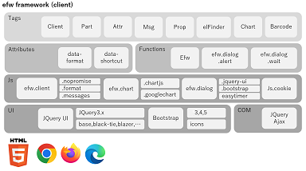
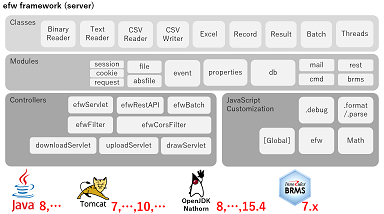

[English](README.md), [日本語](README_J.md), [中文](README_C.md)

## Introduction

&nbsp;&nbsp;&nbsp;&nbsp;&nbsp;&nbsp;&nbsp;&nbsp;&nbsp;&nbsp;&nbsp;&nbsp;&nbsp;&nbsp;&nbsp;&nbsp;&nbsp;&nbsp;
 

* [What is Efw?](https://qiita.com/changkejun/items/844953846f3e6bed4a9d)
* [Efw Security Related Explanation](https://qiita.com/changkejun/items/70184f814ff52f862d91)
* [Build a High Loads Tomcat Environment](https://qiita.com/changkejun/items/fb325ed0a9d81f3bf5f0)

## Samples

* [Test Each Type of Input Element](https://qiita.com/changkejun/items/2f59403e8fa3b0f40eb7) ([helloworld/InputTest.jsp](https://github.com/efwGrp/qittaSamples/tree/main/helloworld/InputTest.jsp))
* [Test Each Type of Value Display](https://qiita.com/changkejun/items/f634ae1c8040cef4cc01) ([helloworld/OutputTest.jsp](https://github.com/efwGrp/qittaSamples/tree/main/helloworld/OutputTest.jsp))
* [Test Each Type of Screen Action](https://qiita.com/changkejun/items/3accadd827594d1bccdf) ([helloworld/ActionTest.jsp](https://github.com/efwGrp/qittaSamples/tree/main/helloworld/ActionTest.jsp))
* [Web File Management with One Tag](https://qiita.com/changkejun/items/3f943f089d44d83296af) ([helloworld/helloElfinder.jsp](https://github.com/efwGrp/qittaSamples/tree/main/helloworld/helloElfinder.jsp))
* [Web Chart Function with One Tag](https://qiita.com/changkejun/items/dc976ccaaf82458c7771) ([helloworld/helloChart.jsp](https://github.com/efwGrp/qittaSamples/tree/main/helloworld/helloChart.jsp))
* [Create Web QR Code with One Tag](https://qiita.com/changkejun/items/0cdef7d8d288f9f0a563) ([helloworld/helloBarcode.jsp](https://github.com/efwGrp/qittaSamples/tree/main/helloworld/helloBarcode.jsp))
* [Let's Graduate from POI](https://qiita.com/changkejun/items/5f6c5b234dc1322ec859) ([helloworld/helloExcelbyPOI.jsp](https://github.com/efwGrp/qittaSamples/tree/main/helloworld/helloExcelbyPOI.jsp))
* [Don't be Afraid of Gigabytes of Text](https://qiita.com/changkejun/items/97af2b8722c149f5335d) ([helloworld/helloTextCSVThread.jsp](https://github.com/efwGrp/qittaSamples/tree/main/helloworld/helloTextCSVThread.jsp))
* [Introduction to Database Processing](https://qiita.com/changkejun/items/d046d1804b4c996700e2) ([helloworld/helloDB.jsp](https://github.com/efwGrp/qittaSamples/tree/main/helloworld/helloDB.jsp))
* [Send to Gmail SMTP](https://qiita.com/changkejun/items/26fe53af470ee1a96b05) ([helloworld/helloMail.jsp](https://github.com/efwGrp/qittaSamples/tree/main/helloworld/helloMail.jsp))
* [Multilingual Support](https://qiita.com/changkejun/items/7d0999b90b0e5370f928) ([helloworld/helloI18n.jsp](https://github.com/efwGrp/qittaSamples/tree/main/helloworld/helloI18n.jsp))
* [Let's Create a Rest API Service](https://qiita.com/changkejun/items/54c3df529a1b83093790) ([helloworld/helloRestAPI.jsp](https://github.com/efwGrp/qittaSamples/tree/main/helloworld/helloRestAPI.jsp))
* [Web App Login Control & Authority Control](https://qiita.com/changkejun/items/c36d3671493225ad14ce) ([skeletonSample](https://github.com/efwGrp/qittaSamples/tree/main/skeletonSample))
* [Try to use pdf-lib and pdfmake on Efw with Javet](https://qiita.com/changkejun/items/5f50cf3d3e935dd90989) ([hello-pdf-lib3](https://github.com/efwGrp/qittaSamples/tree/main/hello-pdf-lib3), [hello-pdfmake3](https://github.com/efwGrp/qittaSamples/tree/main/hello-pdfmake3))

* [dialog](samples/dialogSample)
* [batch](samples/batchSample)
* [helloAzure](samples/helloAzure)

# API

## Properties

* [efw.properties](help/e/properties.web.md)
* [batch.properties](help/e/properties.batch.md)

## Resources

* [Context XML](help/e/resources.context.md)

## JSP

| Categories | Items  |||||
|---|---|---|---|---|---|
| Base Tags | [Client](help/e/tag.client.md) | [Part](help/e/tag.part.md) | [Attr](help/e/tag.attr.md) | [Msg](help/e/tag.msg.md) | [Prop](help/e/tag.prop.md) |
| Additional Tags | [elFinder](help/e/tag.elfinder.md) | [Chart](help/e/tag.chart.md) | [Barcode](help/e/tag.barcode.md) |  |  |
| Tag Params | [msg:](help/e/tag.attr.msg.md) | [prop:](help/e/tag.attr.prop.md) |  |  |  |
| Functions | [Efw](help/e/api_efw_function.md) | [alert](help/e/efw.dialog.alert.md) | [wait](help/e/efw.dialog.wait.md) |  |  |
| Attributes | [data-format](help/e/api_data_format.md) | [data-shortcut](help/e/api_data_shortcut.md) |  |  |  |

## Outside SQL

* [SQL XML](help/e/api_sql.md)

## Outside Mail

* [Mail XML](help/e/api_mail.md)

## Multi Language

* [Language XML](help/e/api_language.md)

## Event JS

* [Web Event](help/e/api_webevent.md)
* [Batch Event](help/e/api_batchevent.md)
* [Rest Event](help/e/api_restevent.md)
* [Global Event](help/e/api_global.md) fires on system loading.

### Modules

| Modules | Attributes/Functions |||||
|---|---|---|---|---|---|
| `[global]` | [`_eventfolder`](help/e/global._eventfolder.md) | [`_isdebug`](help/e/global._isdebug.md) | [`load`](help/e/global.load.md) | [`loadWithNewGlobal`](help/e/global.loadWithNewGlobal.md) | [`loadWithGlobalPool`](help/e/global.loadWithGlobalPool.md) |
| `efw` | [`register`](help/e/efw.register.md) | [`contains`](help/e/efw.contains.md) |  |  |  |
| `cmd` | [`execute`](help/e/cmd.execute.md) |  |  |  |  |
| `file` | [`get`](help/e/file.get.md) | [`list`](help/e/file.list.md) | [`isFile`](help/e/file.isFile.md) | [`isFolder`](help/e/file.isFolder.md) | [`makeFile`](help/e/file.makeFile.md) |
|  | [`exists`](help/e/file.exists.md) | [`duplicate`](help/e/file.duplicate.md) | [`rename`](help/e/file.rename.md) | [`remove`](help/e/file.remove.md) | [`makeDir`](help/e/file.makeDir.md) |
|  | [`readAllLines`](help/e/file.readAllLines.md) | [`writeAllLines`](help/e/file.writeAllLines.md) | [`getStorageFolder`](help/e/file.getStorageFolder.md) | [`saveUploadFiles`](help/e/file.saveUploadFiles.md) | [`saveSingleUploadFile`](help/e/file.saveSingleUploadFile.md) |
|  | [`readAllBytes`](help/e/file.readAllBytes.md) | [`writeAllBytes`](help/e/file.writeAllBytes.md) | [`getTempFileName`](help/e/file.getTempFileName.md) | [`move`](help/e/file.move.md) |  |
| `absfile` | All APIs are the same as the `file` object, except that the path parameter is an absolute one.  |||||
| `barcode` | [`decode`](help/e/barcode.decode.md) |  |  |  |  |
| `brms` | [`getRuleById`](help/e/brms.getRuleById.md) | [`getRuleByName`](help/e/brms.getRuleByName.md) | [`getRuleByAlias`](help/e/brms.getRuleByAlias.md) |  |  |
| `rest` | [`get`](help/e/rest.get.md) | [`post`](help/e/rest.post.md) | [`put`](help/e/rest.put.md) | [`delete`](help/e/rest.delete.md) | [`getStatus`](help/e/rest.getStatus.md) |
| `event` | [`fire`](help/e/event.fire.md) |  |  |  |  |
| `db` | [`select`](help/e/db.select.md) | [`change`](help/e/db.change.md) | [`master`](help/e/db.master.md) |  |  |
|  | [`_commit`](help/e/db._commit.md) | [`_rollback`](help/e/db._rollback.md) | [`_commitAll`](help/e/db._commitAll.md) | [`_rollbackAll`](help/e/db._rollbackAll.md) |  |
|  | All transaction functions, as a default, do not need to be called explicitly.  |||||
| `mail` | [`send`](help/e/mail.send.md) |  |  |  |  |
| `properties` | [`get`](help/e/properties.get.md) |  |  |  |  |
| `session` | [`get`](help/e/session.get.md) | [`set`](help/e/session.set.md) | [`create`](help/e/session.create.md) | [`invalidate`](help/e/session.invalidate.md) |  |
| `cookie` | [`get`](help/e/cookie.get.md) | [`set`](help/e/cookie.set.md) |  |  |  |
| `request` | [`get`](help/e/request.get.md) |  |  |  |  |
| `{ any }` | [`format`](help/e/any.format.md) | [`parse`](help/e/any.parse.md) | [`debug`](help/e/any.debug.md) |  |  |
| `{ Date }` | [`getYears`](help/e/Date.getYears.md) |  |  |  |  |
| `{ String }` | [`base64Encode`](help/e/String.base64Encode.md) | [`base64EncodeURI`](help/e/String.base64EncodeURI.md) | [`base64Decode`](help/e/String.base64Decode.md) |  |  |
| `Math` | [`ROUND`](help/e/Math.ROUND.md) | [`ROUNDUP`](help/e/Math.ROUNDUP.md) | [`ROUNDDOWN`](help/e/Math.ROUNDDOWN.md) |  |  |

### Classes

| Classes | Attributes/Functions |||||
|---|---|---|---|---|---|
| `BinaryReader` | [`new`](help/e/BinaryReader.new.md) | [`readAllLines`](help/e/BinaryReader.readAllLines.md) | [`loopAllLines`](help/e/BinaryReader.loopAllLines.md) |  |  |
| `BinaryWriter` | [`new`](help/e/BinaryWriter.new.md) | [`writeAllLines`](help/e/BinaryWriter.writeAllLines.md) | [`writeLine`](help/e/BinaryWriter.writeLine.md) | [`close`](help/e/BinaryWriter.close.md) |  |
| `TXTReader` | [`new`](help/e/TXTReader.new.md) | [`readAllLines`](help/e/TXTReader.readAllLines.md) | [`loopAllLines`](help/e/TXTReader.loopAllLines.md) |  |  |
| `CSVReader` | [`new`](help/e/CSVReader.new.md) | [`readAllLines`](help/e/CSVReader.readAllLines.md) | [`loopAllLines`](help/e/CSVReader.loopAllLines.md) |  |  |
| `CSVWriter` | [`new`](help/e/CSVWriter.new.md) | [`writeAllLines`](help/e/CSVWriter.writeAllLines.md) | [`writeLine`](help/e/CSVWriter.writeLine.md) | [`close`](help/e/CSVWriter.close.md) |  |
| `Excel` | [`new`](help/e/excel.new.md) | [`save`](help/e/excel.save.md) | [`close`](help/e/excel.close.md) | [`getSheetNames`](help/e/excel.getSheetNames.md) |  |
|  | [`createSheet`](help/e/excel.createSheet.md) | [`removeSheet`](help/e/excel.removeSheet.md) | [`setSheetOrder`](help/e/excel.setSheetOrder.md) | [`setActiveSheet`](help/e/excel.setActiveSheet.md) |  |
|  | [`getMaxRow`](help/e/excel.getMaxRow.md) | [`setPrintArea`](help/e/excel.setPrintArea.md) | [`showSheet`](help/e/excel.showSheet.md) | [`hideSheet`](help/e/excel.hideSheet.md) | [`zoomSheet`](help/e/excel.zoomSheet.md) |
|  | [`addRow`](help/e/excel.addRow.md) | [`delRow`](help/e/excel.delRow.md) | [`showRow`](help/e/excel.showRow.md) | [`hideRow`](help/e/excel.hideRow.md) |  |
|  |  |  | [`showCol`](help/e/excel.showCol.md) | [`hideCol`](help/e/excel.hideCol.md) |  |
|  | [`getArray`](help/e/excel.getArray.md) | [`getSingle`](help/e/excel.getSingle.md) | [`getValue`](help/e/excel.getValue.md) | [`setCell`](help/e/excel.setCell.md) | [`setLink`](help/e/excel.setLink.md) |
|  | [`isEncircled`](help/e/excel.isEncircled.md) | [`encircle`](help/e/excel.encircle.md) | [`addShape`](help/e/excel.addShape.md) | [`addShapeInRange`](help/e/excel.addShapeInRange.md) | [`replacePicture`](help/e/excel.replacePicture.md) |
| `Pdf` | [`new`](help/e/pdf.new.md) | [`save`](help/e/pdf.save.md) | [`close`](help/e/pdf.close.md) | [`setField`](help/e/excel.setField.md) |  |
|  | [`html2pdf`](help/e/pdf.html2pdf.md) | [`getFontNames`](help/e/getFontNames.md) |
| `Record` | [`new`](help/e/record.new.md) |  |  |  |  |
|  | [`seek`](help/e/record.seek.md) | [`sort`](help/e/record.sort.md) | [`map`](help/e/record.map.md) | [`makeAllKeysUpperCase`](help/e/record.makeAllKeysUpperCase.md) | [`makeAllKeysLowerCase`](help/e/record.makeAllKeysLowerCase.md) |
|  | [`getArray`](help/e/record.getArray.md) | [`getSingle`](help/e/record.getSingle.md) | [`getValue`](help/e/record.getValue.md) | [`length`](help/e/record.length.md) |  |
| `Result` | [`new`](help/e/result.new.md) | [`concat`](help/e/result.concat.md) |  |  |  |
|  | [`runat`](help/e/result.runat.md) | [`remove`](help/e/result.remove.md) | [`append`](help/e/result.append.md) | [`withdata`](help/e/result.withdata.md) |  |
|  | [`show`](help/e/result.show.md) | [`hide`](help/e/result.hide.md) | [`enable`](help/e/result.enable.md) | [`disable`](help/e/result.disable.md) |  |
|  | [`highlight`](help/e/result.highlight.md) | [`attach`](help/e/result.attach.md) | [`deleteAfterDownload`](help/e/result.deleteAfterDownload.md) | [`saveas`](help/e/result.saveas.md) |  |
|  | [`confirm`](help/e/result.confirm.md) | [`alert`](help/e/result.alert.md) | [`focus`](help/e/result.focus.md) | [`eval`](help/e/result.eval.md) | [`navigate`](help/e/result.navigate.md) |
| `Batch` | [`new`](help/e/batch.new.md) | [`concat`](help/e/batch.concat.md) |  |  |  |
|  | [`log`](help/e/batch.log.md) | [`echo`](help/e/batch.echo.md) | [`exit`](help/e/batch.exit.md) |  |  |
| `Threads` | [`new`](help/e/threads.new.md) | [`add`](help/e/threads.add.md) | [`run`](help/e/threads.run.md) |  |  |

# References

* [Standard Javascript API](help/e/Standard_Javascript_API.md)
* [jQuery Selectors API](help/e/jQuery_Selectors_API.md)
* [Nashorn Extensions](https://wiki.openjdk.org/display/Nashorn/Nashorn+extensions)
* [Nashorn Ext for ES6](https://github.com/efwGrp/nashorn-ext-for-es6)
* [HTML](https://www.tohoho-web.com/html/index2.htm)
* [CSS](https://www.tohoho-web.com/css/index.htm)

# They use our products

 
 
 
 
 
 

