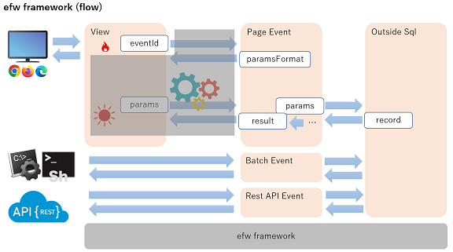
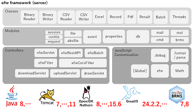

[English](README.md), [日本語](README_J.md), [中文](README_C.md)

## はじめに

&nbsp;&nbsp;&nbsp;&nbsp;&nbsp;&nbsp;&nbsp;&nbsp;&nbsp;&nbsp;&nbsp;&nbsp;&nbsp;&nbsp;&nbsp;&nbsp;&nbsp;&nbsp;
 

* [Efwとは](https://efwgrp.github.io/efw4.X/index_j.html)
* [EFWのセキュリティ](https://efwgrp.github.io/efw4.X/security_j.html)
* [高負荷Tomcat環境の構築](https://efwgrp.github.io/efw4.X/highload_j.html)
* [EFWコーディング規約](https://qiita.com/Victory963/items/ec028606e382a1d3a174)

## [サンプル](https://efwgrp.github.io/efw4.X/samples_j.html)

## [API](https://efwgrp.github.io/efw4.X/j/api.html)

# 導入実績

 
 
 
 
 
 

