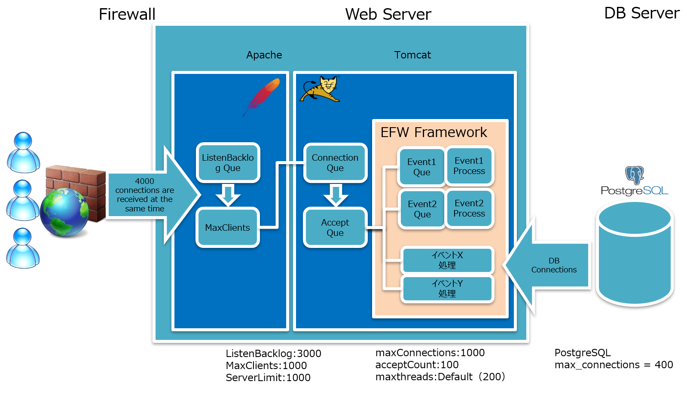
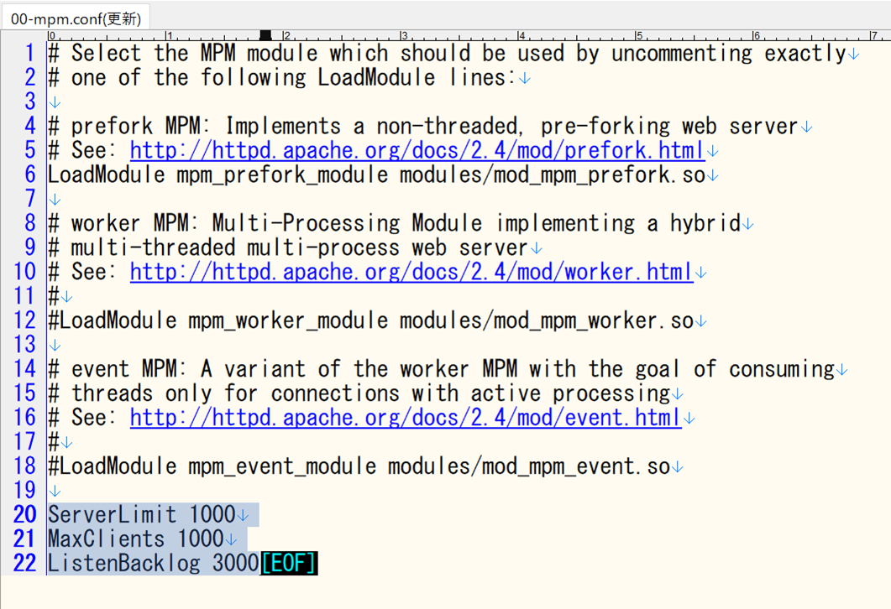
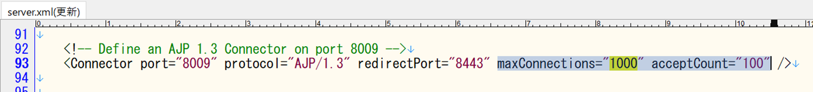
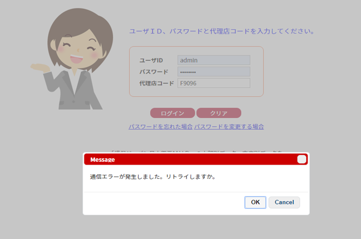
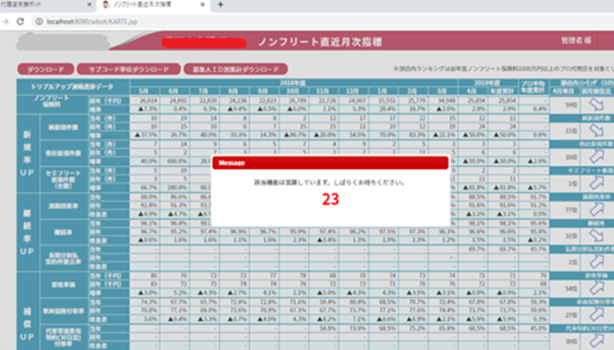
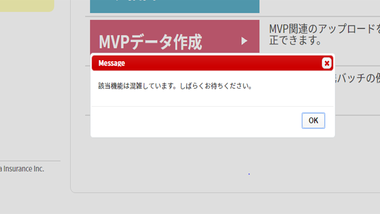

# 【efw 介绍】高负载对应下的 Tomcat 环境构建

## WEB 系统的“并发连接”是什么？

“并发连接”这个词在 WEB 系统开发中经常被提及，但却常在定义不明的情况下被滥用。这次我们将包含一些相关术语，来尝试建立一个**严格的定义**。

<table>
<tr><th>项目</th><th>说明</th></tr>
<tr><td>最大登录用户数</td><td>
登录后，会创建会话信息，并占用一定的内存。根据系统的实现方式，如果会话内存较大，则需要注意在会话超时期限内登录的用户数量。
</td></tr>
<tr><td>最大并发连接数</td><td>
TCP 连接从“Established”到“Closed”期间，被视为“连接中”。某一时刻，连接中的连接数就是**并发连接数**。一次画面操作会产生两个连接。※ jsp 和各种静态内容。输出完成后，连接会维持 15 秒。

如果超过最大并发连接数，服务器将不接受连接请求，因此会发生“无法访问此网站”的错误。※ 不是 404 错误。
</td></tr>
<tr><td>最大并发执行数</td><td>
服务器可以**同时处理**的请求数量。
</td></tr>
<tr><th colspan=2>＜一旦开始（よういスタート）的情况＞※ 展会、说明会、研讨会等
</th></tr>
<tr><td>仅限一次的操作</td><td>
可以进行无错误操作的人数 = 最大并发连接数 / 2
</td></tr>
<tr><td>连续每秒操作一次 ※ 1 秒以内的轻量级处理</td><td>
可以进行无错误操作的人数 = 最大并发连接数 / 2 / 15
</td></tr>
<tr><td>连续每秒操作一次 ※ 重量级处理</td><td>
可以进行无错误操作的人数 = min( 最大并发执行数 , 最大并发连接数 / 2 / 15 )
</td></tr>
</table>

## 系统概念图

以下系统概念图是 efw 应用 + tomcat 在应对高负载时的各种配置信息示例。

<table>
<tr><th>项目</th><th>默认值</th><th>说明</th></tr>
<tr><td>ListenBackLog</td><td>
Window32/64: 200 
Solaris32/64,Linux32/64: 511 
</td><td>
用于排队等待 TCP 连接建立请求的**连接等待队列**的最大数量。
连接等待队列最大数量的指定范围
Window32/64: 1～200
Solaris32/64,Linux32/64: 1～2147483647
</td></tr>
<tr><td>MaxClients</td><td>256</td><td>
可以响应的**并发请求数**。
</td></tr>
<tr><td>ServerLimit</td><td>256</td><td>
设置 Apache 进程运行时 MaxClients 可设置的**上限值**，有 20000 以下的限制。
</td></tr>
<tr><td>maxConnections</td><td>
NIO: 10000 
NIO2: 10000 
APR/Native: 8192
</td><td>
服务器在任何给定时间可以接受和处理的**最大连接数**。将值设置为 -1 会禁用 maxConnections 功能，并且不计入连接数。
</td></tr>
<tr><td>acceptCount</td><td>100</td><td>
当所有可能的请求处理线程都在使用时，传入连接请求的**最大队列长度**。当队列已满时收到的请求将被拒绝。
</td></tr>
<tr><td>maxthreads</td><td>200</td><td>
此连接器为请求处理创建的**最大线程数**（最大并发执行数）。未指定 Executor 属性的 Connector 属性将配置一个线程池。
该线程池中实际处理来自等待队列的请求的**最大线程数**。
</td></tr></tr>
</table>

## 配置位置

## 系统概念图说明

当客户端有大量连接时，

  - 首先存储在 Apache 的 **ListenBacklog** 队列中，其中 1000 个连接被传递给 Tomcat。
  - Tomcat 接收连接请求，并存储在 **Connection 队列**中。
  - 从 Connection 队列中将 100 个连接转移到 **Accept 队列**进行处理。
  - Connection 队列中的空闲部分，由后续的连接请求来补充。
  - 为了确保不超过 Connection 队列的最大值，需要使 MaxClients 和 maxConnections 的值保持一致。

当 EFW 框架处理 Connection 队列中的连接请求时，

  - 对于**重量级处理**，针对每个事件设置**同时处理可能队列**。达到队列最大值时，返回错误。
  - 对于**轻量级处理**，不设置同时处理可能队列。

事件队列达到最大值时的错误有**两种**：

  - 如果设置为**可重试**，则显示错误消息并进行 30 秒倒计时。
  - 如果设置为**不可重试**，则仅显示错误消息。
    “该功能目前繁忙，请稍后再试。”

## ListenBackLog 队列溢出

当服务器连接处于**满载状态**时，如果进行新的操作，将显示左图所示的错误消息。

## 事件队列溢出（可重试）

当**重量级操作**受到限制时，将显示左图所示的倒计时消息（30 秒计时）。**可重试**。

## 事件队列溢出（不可重试）

当操作受到限制时，将显示左图所示的繁忙消息。**不可重试**。
