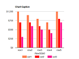
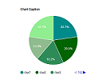
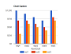
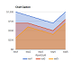
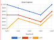

# Chart 标签

[Google Charts](https://developers.google.com/chart/) 和 [Chart.js](https://www.chartjs.org/) 是流行的 HTML5 图表库，用于 Web 开发。 我们创建了一些模板来简化它们的使用，并以标签的形式包含在 Efw 中。 它必须在包含 jQuery 和 jQuery UI 的 `Client` 标签之后使用。

```jsp
<%@ taglib prefix="efw" uri="efw" %>
<head>
 <efw:Client/>
 <script>
  function func1(options) {
   // alert(JSON.stringify(options)); // 以字符串形式显示选项。
   options.options.vAxis.ticks = [100, 1000000]; // 这将覆盖 data-ticks 属性
  }
 </script>
</head>
<body>
 <efw:Chart id="char1" data="chart1_data" type="column" width="400" height="250" version="45.2" setoptions="func1" /> // 或 efw:chart, efw:CHART

 <table border="1" id="chart1_data" data-format="#,##0百万円" data-legend="bottom" data-ticks="100,1000000">
  <caption>会社業績</caption>
  <tr><th>年度</th><th data-color="red">売上高</th><th data-color="green">営業利益</th><th data-color="blue">経常利益</th></tr>
  <tr><td>2004 年</td><td>1,000百万円</td><td>400百万円</td><td>380百万円</td></tr>
  ...
 </table>
</body>
```

## 属性

| 名称 | 是否必需 | 默认值 | 描述 |
|---|---|---|---|
| `id` | 是 | | `Chart` 标签的 ID。 |
| `mode` | 否 | `"googlechart"` | 设置图表库为 `"googlechart"` 或 `"chartjs"`。 |
| `data` | 是 | | 要与 `Chart` 标签一起使用的数据表的 ID。 |
| `type` | 是 | | 图表的类型。 [演示](https://efwgrp.github.io/efw4.X/chart/chartSampleTypes.html)。 |
| `height` | 否 | `"400"` | `Chart` 标签的高度，单位为像素。 |
| `width` | 否 | `"auto"` | `Chart` 标签的宽度，单位为像素。 |
| `version` | 否 | `"current"` | 要使用的 Google Charts 版本。 |
| `setoptions` | 否 | | 用于为 Google Charts 设置选项的自定义 JavaScript 函数的名称。 |
| `data-format` | 否 | | 数据的格式。如果定义，则工具提示数据将格式化。 |
| `data-legend` | 否 | | 图例的位置：`none`、`left`、`right`、`top` 或 `bottom`。 |
| `data-color` | 否 | | 项目的颜色。使用 RGB 或行或列标题中的颜色名称设置。[演示](https://efwgrp.github.io/efw4.X/chart/chartSampleColors.html)。<br> |
| `data-ticks` | 否 | | 图表的刻度。 |

## 方法

| 调用 | 返回值 | 描述 |
|---|---|---|
| `chart.draw()` | `void` | 重绘图表。 |
| `chart.setType(type)` | `void` | 设置 `type` 属性。 |
| `chart.setHeight(height)` | `void` | 设置 `height` 属性。 |
| `chart.setWidth(width)` | `void` | 设置 `width` 属性。 |


##### 面向Google Chart的图标类型

||||||
|---|---|---|---|---|
|column|stackedcolumn|line|pie|donut|
||||||
|bar|stackedarea|area|scatter| |
||||||

##### 面向Chart Js的图标类型

||||||
|---|---|---|---|---|
|column|stackedcolumn|line|pie|donut|
||||||
|bar|stackedarea|area|scatter|radar|
||||||
