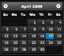
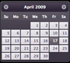
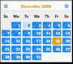
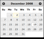
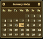
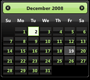

# Client 标签

要使用 Efw 进行开发，你需要将几个 `.js` 和 `.css` 文件导入到你的 JSP 页面中。`Client` 标签简化了此过程。

```jsp
...
<%@ taglib prefix="efw" uri="efw" %>
<head>
...
<efw:Client baseurl="/appfolder" mode="jquery-ui" theme="base" lang="en" /> // efw:client 或 efw:CLIENT
...
</head>
```
## 属性

| 名称 | 是否必需 | 默认值 | 描述 |
|---|---|---|---|
| `baseurl` | 否 | `"."` | Web 应用程序的基础 URL。如果你的页面不在根文件夹中，则这是必需的。 |
| `mode` | 否 | `"jquery-ui"` | 设置 UI 框架为 `"jquery-ui"` 或 `"bootstrap"`。 |
| `theme` | 否 | `"base"` | 设置 jQuery UI 的主题。 |
| `major` | No | `"4"` | 设置 Bootstrap 的主版本 (2, 3, 4, or 5)。 |
| `lang` | No | `"en"` | 设置语言。语言文件应位于多语言文件夹中。 |
| `nopromise` | No | `"false"` |如果您的浏览器不支持 JavaScript Promises，则设置为“true”。|

##### jQuery UI 主题

| | | | | |
|---|---|---|---|---|
|base|black-tie|blitzer|cupertino|dark-hive|
||||||
|dot-luv|eggplant|excite-bike|flick|hot-sneaks|
!|||||
|humanity|le-frog|mint-choc|overcast|pepper-grinder|
||||||
|redmond|smoothness|south-street|start|sunny|
||||||
|swanky-purse|trontastic|ui-darkness|ui-lightness|vader|
||||||
