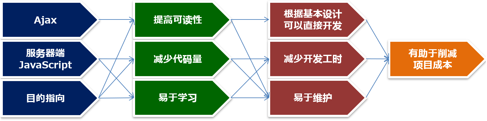

# 【Efw 介绍】什么是 Efw

EFW (Escco-Framework) 是由 Escco Japan 株式会社采用目的指向的方法设计和开发的服务器端 JavaScript Ajax 框架。引入 EFW 具有多项特点，
可以降低 Web 开发的难度，例如大幅减少 Web 开发的程序代码量，以及能够迅速应对审查和规格变更等。对于在 Java Web 开发中遇到挑战的客户，我们诚挚推荐您考虑使用 EFW。

## 1、程序的可读性

程序的可读性指的是理解程序的目的和处理流程的难易程度。(出自：wiki/可读性)

“易于理解”的程序体现在以下两方面：
- 目的的易于理解性
程序的粒度是否易于与设计文档的粒度相映射。
- 处理流程的易于理解性
程序的记载顺序是否易于与设计文档的记载顺序相映射。

传统的 Web 开发存在以下问题：
- 问题１、规格文档的一行描述，在程序中可能需要数十行代码来实现。
- 问题２、针对规格文档清晰的处理顺序，程序中的流程跳转分散各处，非专业人士难以清晰地理解处理顺序。

## 2-1、传统 Web 开发中的 问题 1
下图展示了问题 1。在基础设计中只有短短的 10 行，但采用 MVC 结构的程序代码可能会超过 100 行。

## 2-2、传统 Web 开发中的 问题 2
下图展示了问题 2。传统 Web 开发的程序流程很复杂，与基础设计相比，简直判若两物。

## 3、Efw 的口号
为了解决上述 Web 开发中的问题，Efw 提出了以下方针：
### 使用Ajax和服务器端 JavaScript，采用目的指向的方法，可以高速构建 Web 系统。

源代码公开：
https://github.com/efwGrp/efw4.X
信息处理学会收录论文：
http://id.nii.ac.jp/1001/00147552/

## 4-1、问题 1 的解决
针对问题 1，使用 Efw 的情况如下所示：

Web 系统开发中存在“参数接收、输入检查、数据展示、启用/禁用、显示/隐藏、画面跳转”等处理。Efw 将这些处理模式化，设计并实现了一套 Web 画面开发的专用语言 (DSL)。换句话说，就是“输入数据收集和处理结果展示的自动化」”。

## 4-2、问题 2 的解决
针对问题 2，使用 Efw 的情况如下所示：

在 Efw 的机制中，无论客户端操作还是服务器端操作，
几乎所有逻辑都集中在事件 JS 文件中。此外，
由于是“目的指向”，程序的粒度易于与设计文档的粒度映射。
因此，仅通过事件 JS 文件就能清晰地理解处理流程。

## 5、Efw 的优势
Efw 的优势由下图所示：

