# Chart Tag

[Google Charts](https://developers.google.com/chart/) and [Chart.js](https://www.chartjs.org/) are popular HTML5 charting libraries for the web. We've created several templates to simplify their use and included them in Efw as a tag. It must be used after the `Client` tag, which includes jQuery and jQuery UI.

```jsp
<%@ taglib prefix="efw" uri="efw" %>
<head>
  <efw:Client/>
  <script>
    function func1(options) {
      // alert(JSON.stringify(options)); // to show the options as string.
      options.options.vAxis.ticks = [100, 1000000]; // this will override the data-ticks attribute
    }
  </script>
</head>
<body>
  <efw:Chart id="char1" data="chart1_data" type="column" width="400" height="250" version="45.2" setoptions="func1" /> // or efw:chart, efw:CHART

  <table border="1" id="chart1_data" data-format="#,##0百万円" data-legend="bottom" data-ticks="100,1000000">
    <caption>会社業績</caption>
    <tr><th>年度</th><th data-color="red">売上高</th><th data-color="green">営業利益</th><th data-color="blue">経常利益</th></tr>
    <tr><td>2004 年</td><td>1,000百万円</td><td>400百万円</td><td>380百万円</td></tr>
    ...
  </table>
</body>
```

## Attributes

| Name | Required | Default | Description |
|---|---|---|---|
| `id` | Yes |  | The ID of the `Chart` tag. |
| `mode` | No | `"googlechart"` | Sets the charting library to `"googlechart"` or `"chartjs"`. |
| `data` | Yes |  | The ID of the data table to use with the `Chart` tag. |
| `type` | Yes |  | The type of chart. [Demo](https://efwgrp.github.io/efw4.X/docs/chart/chartSampleTypes.html). |
| `height` | No | `"400"` | The height of the `Chart` tag in pixels. |
| `width` | No | `"auto"` | The width of the `Chart` tag in pixels. |
| `version` | No | `"current"` | The version of Google Charts to use. |
| `setoptions` | No |  | The name of a custom JavaScript function to set options for Google Charts. |
| `data-format` | No |  | The format of the data. If defined, the tooltip data will be formatted. |
| `data-legend` | No |  | The position of the legend: `none`, `left`, `right`, `top`, or `bottom`. |
| `data-color` | No |  | The color of items. Set with RGB or color names in row or column titles. [Demo](https://efwgrp.github.io/efw4.X/docs/chart/chartSampleColors.html).<br>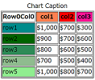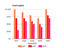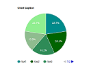 |
| `data-ticks` | No |  | The gradations of the chart. |

## Methods

| Calling | Returning | Description |
|---|---|---|
| `chart. draw ( )` | `void` | Redraws the chart. |
| `chart. setType ( type )` | `void` | Sets the `type` attribute. |
| `chart. setHeight ( height )` | `void` | Sets the `height` attribute. |
| `chart. setWidth ( width )` | `void` | Sets the `width` attribute. |

##### Type for Google Chart

||||||
|---|---|---|---|---|
|column|stackedcolumn|line|pie|donut|
|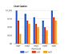|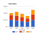|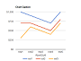|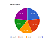|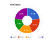|
|bar|stackedarea|area|scatter|
|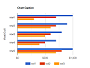|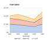|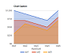|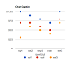|

##### Type for Chart Js

||||||
|---|---|---|---|---|
|column|stackedcolumn|line|pie|donut|
|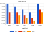||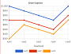|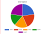|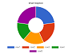|
|bar|stackedarea|area|scatter|radar|
|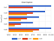||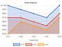||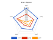|


