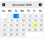
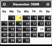

# Client Tag

To develop with Efw, you need to import several `.js` and `.css` files into your JSP pages. The `Client` tag simplifies this process.

```jsp
...
<%@ taglib prefix="efw" uri="efw" %>
<head>
...
<efw:Client baseurl="/appfolder" mode="jquery-ui" theme="base" lang="en" /> // efw:client or efw:CLIENT
...
</head>
```
## Attributes

| Name | Required | Default | Description |
|---|---|---|---|
| `baseurl` | No | `"."` | The web application base URL. This is required if your page is not in the base folder. |
| `mode` | No | `"jquery-ui"` | Sets the UI framework to `"jquery-ui"` or `"bootstrap"`. |
| `theme` | No | `"base"` | Sets the theme for jQuery UI. |
| `major` | No | `"4"` | Sets the major version for Bootstrap (2, 3, 4, or 5). |
| `lang` | No | `"en"` | Sets the language. Language files should be located in the multi-language folder. |
| `nopromise` | No | `"false"` | Set to `"true"` if your browser does not support JavaScript Promises. |

##### jQuery UI Themes

| | | | | |
|---|---|---|---|---|
|base|black-tie|blitzer|cupertino|dark-hive|
||||||
|dot-luv|eggplant|excite-bike|flick|hot-sneaks|
!|||||
|humanity|le-frog|mint-choc|overcast|pepper-grinder|
||||||
|redmond|smoothness|south-street|start|sunny|
||||||
|swanky-purse|trontastic|ui-darkness|ui-lightness|vader|
||||||
