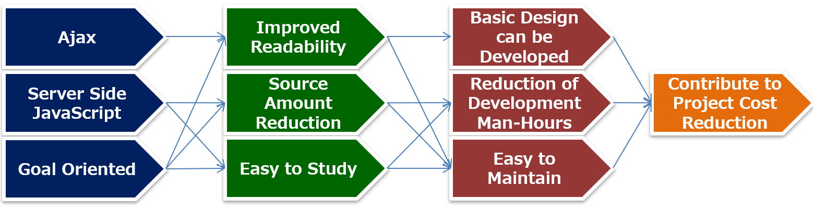

# What is Efw?

EFW (Escco-Framework) is an Ajax framework for server-side JavaScript designed and developed by Escco Japan Co., Ltd. using a goal-oriented approach. By introducing EFW, there are various features that can reduce the difficulty of web development, such as a significant reduction in the amount of web development programs and the ability to quickly respond to reviews and specification changes. If you are having issues with Java web development, please consider using EFW.

## 1. Program readability
Program readability refers to the ease with which a program's purpose and processing flow can be understood.　(From : wiki/可読性)
"Easy to understand" can be considered as follows.
- Easy to understand purpose
Is it easy to map the granularity of the program to the granularity of the design document?
- Easy to understand process flow
Is it easy to map the program description order to the design document order?

In conventional web development, the following phenomena that often exist can be considered problems.
- Problem 1: For each line in the specification, the program must consist of dozens of lines.
- Problem 2: Despite the clear processing order in the specification, the program transitions here and there,If you are not a professional, you cannot clearly read the processing order.

## 2-1. Problem 1 in conventional web development
The diagram below represents problem 1. A basic design requires only 10 lines, but an MVC-configured program will require over 100 lines.

## 2-2. Problem 2 in conventional web development
The figure below represents problem 2. The program flow for conventional web development is completely different from the basic design.

## 3. Efw Slogan
In order to solve the above web development problems, Efw proposes the following policy.
### Use Ajax and Server site JavaScript to create a goal-oriented and high-speed web system. You can build it.

Source disclosure:
https://github.com/efwGrp/efw4.X
Papers included in Information Processing Society of Japan:
http://id.nii.ac.jp/1001/00147552/

## 4-1. Solving Conventional Problem 1
For question 1, Efw's answer is as follows.

Web system development often involves processing such as "parameter reception, input check, data display, activation/deactivation, display/hide, screen transition". Efw designs and implements domain special language (DSL) for web page development by patterning them. In other words, it is "automation of input data collection and processing result display".

## 4-2. Solving conventional problem 2
For question 2, Efw's answer is as follows.

In the Efw mechanism, almost all the logic is concentrated in the event JS file, regardless of whether it is client or server operation.In addition, because it is "goal-oriented," the granularity of the program is easy to map with the design document. And The process flow can be easily read with just the Event JS file.

## 5. Benefits of EFW
The benefits of EFW are illustrated in the diagram below.

