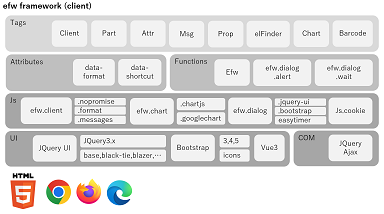

# EFW フレームワーク

Ajax とサーバー側 JavaScript を使用して高速な Web システムを構築するための目標指向アプローチを備えた Web 向けエンタープライズ フレームワークです。

## 紹介

&nbsp;&nbsp;&nbsp;&nbsp;&nbsp;&nbsp;&nbsp;&nbsp;&nbsp;&nbsp;&nbsp;&nbsp;&nbsp;&nbsp;&nbsp;&nbsp;&nbsp;&nbsp;
 

- **革新的な開発手法** - EFWは目的指向アプローチを採用し、AjaxとサーバーサイドJavaScriptで高速なWebシステムを構築します
- **コード量の大幅削減** - EFWの導入によりWeb開発の複雑さが大幅に軽減され、コード量の削減や要件レビュー・仕様変更への迅速な対応が可能になります
- **開発効率の向上** - 繰り返しのコーディング作業を減らし、開発サイクルを大幅に短縮、要件変更に迅速に対応できます

---

## 主な機能

### [EFWとは？](what.md)
EFWフレームワークの基本概念、コアとなる利点、設計理念について学び、目的指向アプローチによる高速Webシステム構築方法を探求します。

### [AIによる特徴分析](analysis.md)
Efwの主要ソースをAIに提供して特徴分析を行いました。データ流れとセキュリティなどの説明は参考になります。

### [EFWのセキュリティ](security.md)
EFWフレームワークのセキュリティ機能、保護メカニズム、ベストプラクティスについて詳しく学び、Webアプリケーションを様々な攻撃から保護します。

### [高負荷Tomcat環境の構築](highload.md)
高負荷環境をサポートするためのTomcatサーバーの設定と最適化方法を学び、高負荷条件下でのアプリケーションの安定した動作を確保します。

---

## リソース

### [サンプル](examples.md)
実際のコードサンプルでEFWフレームワークの応用を学び、EFWフレームワークの開発効率と簡潔さを体験できます。

### [API](api.md)
EFWフレームワークのAPIインターフェースと使用方法について詳しく学び、詳細なAPIドキュメントを参照してEFWフレームワークのすべての強力な機能を活用できます。

---

## 導入企業

 
 
 
 
 

