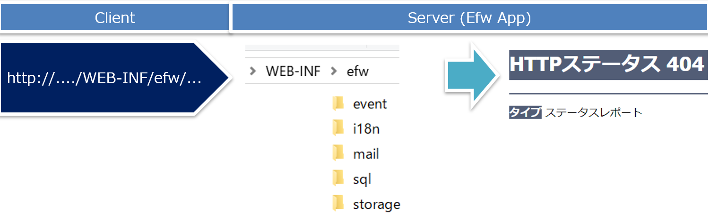
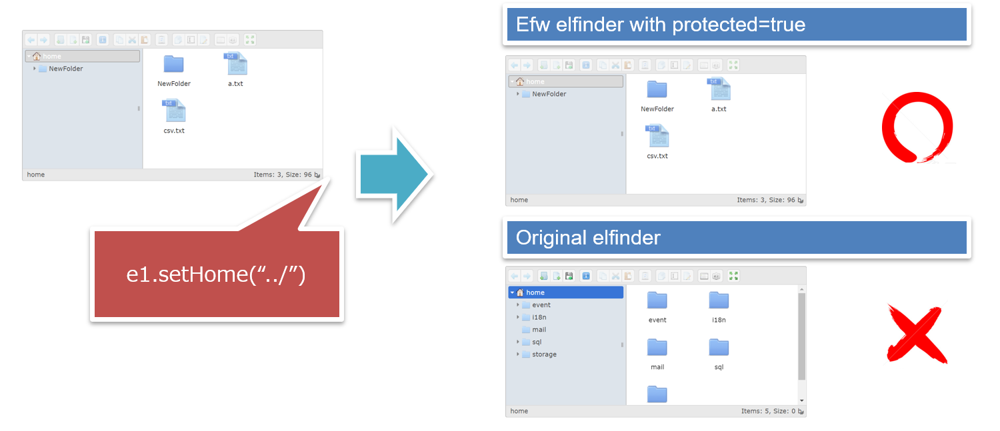
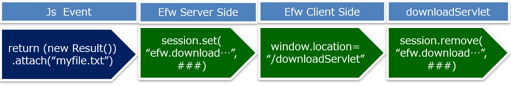
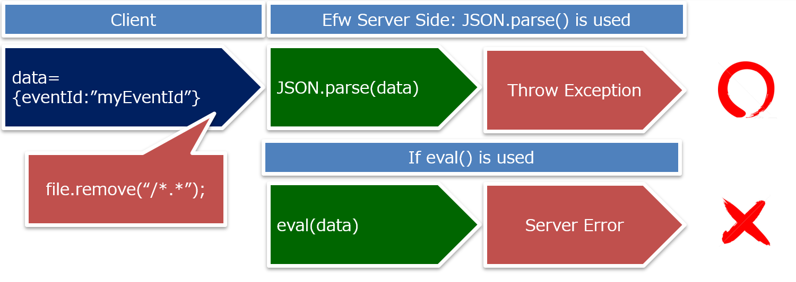
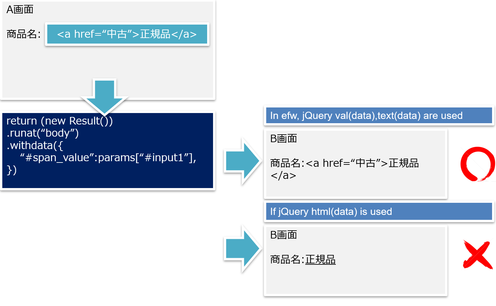
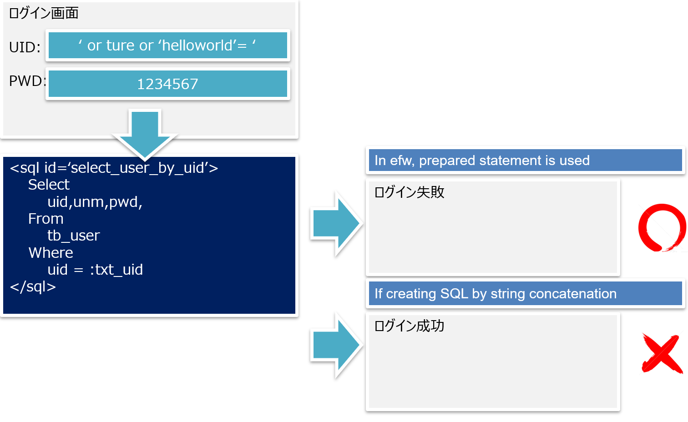
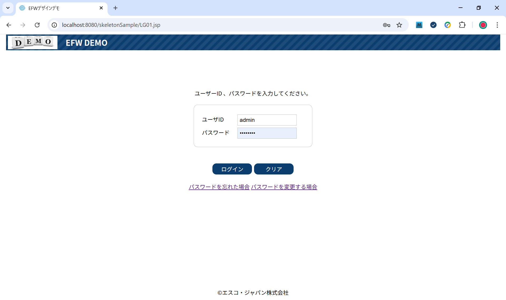

# 【efw紹介】Efwのセキュリティ関連の説明

## １、ファイル流出とは
Webサーバ内のファイルがインターネット上の攻撃者によってどんどん読み出されてしまうセキュリティ問題のカテゴリーです。これはWebアプリケーションの脆弱性のうちもっとも基本的なものです。ファイル流出対策ができていないWebサイトは、最もセキュリティレベルの低いサイトの部類に入ります。このようなところでは、ほかのセキュリティ脆弱性対策を行ってもほとんど効果がありません。

ファイル流出のカテゴリーの問題には、データの蓄積場所としてWeb公開領域を使っている、サーバ内のファイルを限定して提供するはずのプログラムが逆にあらゆるファイルを流出させてしまう、Webアプリケーションのソースコードが何らかの形で読み出されてしまう、などがあります。
(From : thinkit.co.jp/Webアプリケーションの脆弱性)

### １－１、efwフォルダの置く場所



efwフレームワークのデフォルト設定で、アプリプログラムと各種リソース（jsp・cssなどを除く）は、Web非公開領域のWEB-INFフォルダに格納します。URLから直接アクセスする場合、404エラーになります。
- event：イベントjsファイルを格納するフォルダ。
- i18n：多国語メッセージ定義を格納するフォルダ。
- mail：メールテンプレートを格納するフォルダ。
- sql：外出しSQLを格納するフォルダ。
- storage：アプリが操作するファイルを格納するフォルダ。

#### 注意点
ただし、Efwのファイル処理APIは、サーバの任意のファイルを操作可能です。また、javaのAPIも利用できるので、ファイル流出を防ぐため、アプリプログラムの注意がやはり必要です。

例えば、画面からの入力値・選択値を直接にサーバ側で操作するファイルの名称として利用する場合、改ざんによりサーバ側で操作すべきファイルの親フォルダを操作される危険性があります。

### １－２、ファイル管理ツールelfinderの改造



elfinderは、有名なWebファイル管理ツールです。オリジナルのelfinderの場合、ホームパス、読み取り専用フラグは、クライアントjavaScriptで変更可能です。efwのelfinderタグに、protected属性を設けてtrueの場合、ホームパス、読み取り専用フラグを変更不可にします。

### １－３、ダウンロードの仕組み



ダウンロードは、必ず一つのイベント発行からスタートします。イベント実行とダウンロード開始の間、ダウンロード対象をセッションで保管します。これにより、クライアントのjavaScript改ざんのみで、ダウンロードを実行させることはできません。

- イベントjsに、attach関数でダウンロードするファイル名またはパス名を設定します。
- フレームワークサーバ側はそれらをセッションに記録します。
- フレームワーククライアント側はdownloadServletを呼び出します。
- downloadServletはダウンロード対象を出力するとともに、セッションをクリアします。
- さらにダウンロードされた後、サーバ側は対象ファイルを削除する機能を備えています。この機能は利用可能の場合、ダウンロードファイル漏洩のリスクをゼロになります。

## ２、パラメータから情報流出とは
あるページから次のページへと場面を切り替える際に受け渡されるパラメータがもとで、別人の個人情報が読み出されるなどの問題が起こる脆弱性のカテゴリーであります。「情報流出」と名づけてはいるが、ショッピングサイトでパラメータがいじられ不当な安値で買い物されてしまうような改ざん系の問題もこのカテゴリーに含まれます。
WebページとWebページの間でパラメータを受け渡す方法には大きく3つあります。それはクエリーストリング、hiddenフィールド、HTTP Cookieだ。これらはどれも情報流出と改ざんを招く危険な存在です。 
(From : thinkit.co.jp/Webアプリケーションの脆弱性)

Efwのサーバ送信はAjaxのPOST方式を利用します。上記の安易な改ざんリスクに当たりません。ただし、リクエスト対象の閲覧可否確認・リクエストパラメータの業務整合性チェックなどは、アプリの個別ロジックで対応する必要です。
フレームワークは、パラメータ送信・画面切り替えに関わる、パラメータのタイプチェック、画面・イベントのログインチェック・ロールチェックを自動化しています。これらは画面機能単位の制御だが、リクエスト対象の閲覧可否確認・リクエストパラメータの業務整合性チェックの代替になりません。インターネット向きシステムの場合、要注意です。

### ２－１、イベントパラメータチェックの仕組み
```js
var myEvent={};
myEvent.paramsFormat={
	“#txt_date”:”format:yyyy/MM/dd;required;display-name:数字項目”,
	“#txt_number”:”format:###,##0;min:0;max:1,000;display-name:文字項目”,
	“#txt_string”:”maxlength:100;display-name:文字項目”,
};
```
クライアントから取得するイベントパラメータは、期待するタイプか否か、パラメータ定義でチェック行う仕組みがあって、クライアント改ざんによるサーバ障害を防ぎます。
### ２－２、ログインチェックの仕組み
```properties
#########login check##########################################
#The flag to check login
efw.login.check = true

#The session key of login
efw.login.key = USER_ID

#login url
efw.login.url = login.jsp

#url pattern out of login check 
efw.outoflogin.url.pattern = [/](LG01|LG02|LG03|error).jsp

#eventid pattern out of login check
efw.outoflogin.eventid.pattern = LG01|LG02|LG03|head_logout
```
ログインしてから閲覧可能な画面・操作できるイベントを、プロパティファイル設定で自動的にログインチェックを行う仕組みがあって、ログインせずのまま、そのアドレスをURL欄に直接入力による情報流出を防ぎます。
### ２－３、ロールチェックの仕組み
```properties
#########auth check##########################################
#The flag to check auth
efw.auth.check = true
・・・
#All cases of auth checking
efw.auth.cases = admin,user

#Define cases one by one
admin.auth.pattern = ^admin.*$
admin.url.pattern = [/]*.jsp
admin.eventid.pattern = .*

user.auth.pattern = ^((?!admin).)*$
user.url.pattern = [/](LG.*|LOG|CRM.*).jsp
user.eventid.pattern = (LG.*|LOG|CRM.*)
```
管理者のみ閲覧可能な画面・操作できるイベントを、プロパティファイル設定で自動的にロールチェックを行う仕組みがあって、一般ユーザが管理者専用画面アドレスをURL欄に直接入力による情報流出を防ぎます。

## ３、インジェクション攻撃の対応策
インジェクション（injection）とは、内部に何かを注入することを意味する言葉です。インジェクション攻撃とは、プログラムがごく普通に受け取る入力データの中にセキュリティを侵害するようなコマンドを巧みに混入し、それをコンピュータ内部で機能させてしまう攻撃手口のことをいます。

インジェクション攻撃の中で最も代表的なものには、データベースに干渉して情報漏えい・情報改ざんを引き起こすSQLインジェクション攻撃があります。そのほかにも、シェルに干渉するOSコマンドインジェクション、XML検索条件をかく乱するXPathインジェクション、ディレクトリ検索条件に干渉するLDAPインジェクションといった攻撃手口が知られています。
(From : thinkit.co.jp/Webアプリケーションの脆弱性)


Efwは以下のようにインジェクション攻撃を想定して対応しています。
- Ajax方式のフレームワークで、サーバ送信JSONにjavaScript挿入を想定し対応しています。
- 「処理結果自動表示」に特殊記号による画面崩れを想定し対応しています。
- SQL実行に特殊記号によるSQL実行失敗・想定外動作をそうて対応しています。

### ３－１、JSON通信のJavaScriptインジェクション防止



クライアントから送信された文字列は直接に、javaScriptオブジェクトとして利用せず、JSON.parseで変換するため、JSON通信のJavaScriptインジェクションを防ぎます。

### ３－２、処理結果自動表示のHTMLインジェクション防止



戻り値を画面に描画する際、jQuery機能を生かしてHTMLインジェクションを防ぎます。
また、以下の機能を利用する際、パラメータの値は、直接画面からのものではないように注意してください。
- Result.append()で処理結果エンコードなし「{{}}」の使い方
- Result.eval()

### ３ー３、プリペアドステートメントのSQLインジェクション防止



Efwは、外出しSQLのパラメータを、プリペアドステートメント方式のパラメータに変換し、SQLインジェクションを防ぎます。

SQLのテーブル名、項目名などパーツを代入したい場合、動的パラメータのAPIをご覧ください。この場合、利用する値は、直接画面からのものではないように注意してください。

## ４、アクセスログに保存される機密情報の暗号化
アクセスログの使いやすさを向上させるため、一部の投稿情報は URL パラメータとして保存されています。そのURLパラメータはアクセスログに登録されています。

例えば以下の画面のログインボタンの処理はユーザIDとパスワードをサーバに送信します。



ログイン処理のアクセスログは、パスワードは以下のように明文になります。
```js
var LG01_submit={};
LG01_submit.name="LG01 ログイン 認証処理";
LG01_submit.paramsFormat={
	"#txt_uid":"required:true;display-name:ユーザID;",//アカウント
	"#txt_pwd":"required:true;display-name:パスワード;",//パスワード
};
LG01_submit.fire=function(params){
```
127.0.0.1 - - [15/Aug/2025:09:58:30 +0900] "POST /skeletonSample/efwServlet?eventId=LG01_submit&lang=jp&params=%7B%22%23txt_uid%22%3A%22admin%22%2C%22%23txt_pwd%22%3A%22<font color=red>11111</font>%22 HTTP/1.1" 200 413

アクセスログに機密情報を暗号化したい場合、イベントjsファイルで機密情報項目を`secure`属性を設定すれば対応できます。
```js
var LG01_submit={};
LG01_submit.name="LG01 ログイン 認証処理";
LG01_submit.paramsFormat={
	"#txt_uid":"required:true;display-name:ユーザID;",//アカウント
	"#txt_pwd":"required:true;display-name:パスワード;secure:true;",//パスワード
};
LG01_submit.fire=function(params){
```
127.0.0.1 - - [15/Aug/2025:10:56:02 +0900] "POST /skeletonSample/efwServlet?eventId=LG01_submit&lang=jp&params=%7B%22%23txt_uid%22%3A%22admin%22%2C%22%23txt_pwd%22%3A%22<font color=red>MTExMTE%3D</font>%22 HTTP/1.1" 200 83
