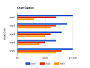
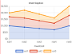
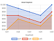
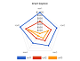

# Chart タグ

[Google Charts](https://developers.google.com/chart/) および [Chart.js](https://www.chartjs.org/) は、Web でよく使用される人気の HTML5 チャートライブラリです。これらの使用を簡素化するためにいくつかのテンプレートを作成し、Efw にタグとして含めました。jQuery と jQuery UI を含む `Client` タグの後に使用する必要があります。

```jsp
<%@ taglib prefix="efw" uri="efw" %>
<head>
  <efw:Client/>
  <script>
    function func1(options) {
      // alert(JSON.stringify(options)); // オプションを文字列として表示する場合。
      options.options.vAxis.ticks = [100, 1000000]; // これは data-ticks 属性をオーバーライドします。
    }
  </script>
</head>
<body>
  <efw:Chart id="char1" data="chart1_data" type="column" width="400" height="250" version="45.2" setoptions="func1" /> // または efw:chart, efw:CHART

  <table border="1" id="chart1_data" data-format="#,##0百万円" data-legend="bottom" data-ticks="100,1000000">
    <caption>会社業績</caption>
    <tr><th>年度</th><th data-color="red">売上高</th><th data-color="green">営業利益</th><th data-color="blue">経常利益</th></tr>
    <tr><td>2004 年</td><td>1,000百万円</td><td>400百万円</td><td>380百万円</td></tr>
    ...
  </table>
</body>
```

## 属性

| 名前 | 必須 | デフォルト | 説明 |
|---|---|---|---|
| `id` | はい |  | `Chart` タグのID。 |
| `mode` | いいえ | `"googlechart"` | チャートライブラリを `"googlechart"` または `"chartjs"` に設定します。 |
| `data` | はい |  | `Chart` タグで使用するデータテーブルのID。 |
| `type` | はい |  | チャートの種類。[デモ](https://efwgrp.github.io/efw4.X/chart/chartSampleTypes.html)。 |
| `height` | いいえ | `"400"` | `Chart` タグの高さをピクセル単位で指定します。 |
| `width` | いいえ | `"auto"` | `Chart` タグの幅をピクセル単位で指定します。 |
| `version` | いいえ | `"current"` | 使用する Google Charts のバージョン。 |
| `setoptions` | いいえ |  | Google Charts のオプションを設定するカスタム JavaScript 関数の名前。 |
| `data-format` | いいえ |  | データの形式。定義されている場合、ツールチップデータがフォーマットされます。 |
| `data-legend` | いいえ |  | 凡例の位置：`none`、`left`、`right`、`top`、または `bottom`。 |
| `data-color` | いいえ |  | 項目の色。行または列のタイトルでRGBまたは色名を設定します。[デモ](https://efwgrp.github.io/efw4.X/chart/chartSampleColors.html)。<br> |
| `data-ticks` | いいえ |  | チャートの目盛り。 |

## メソッド

| 呼び出し | 戻り値 | 説明 |
|---|---|---|
| `chart. draw ( )` | `void` | チャートを再描画します。 |
| `chart. setType ( type )` | `void` | `type` 属性を設定します。 |
| `chart. setHeight ( height )` | `void` | `height` 属性を設定します。 |
| `chart. setWidth ( width )` | `void` | `width` 属性を設定します。 |


##### Google Chart向けの種類

||||||
|---|---|---|---|---|
|column|stackedcolumn|line|pie|donut|
||||||
|bar|stackedarea|area|scatter| |
||||||

##### Chart Js向けの種類

||||||
|---|---|---|---|---|
|column|stackedcolumn|line|pie|donut|
||||||
|bar|stackedarea|area|scatter|radar|
||||||
