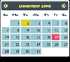
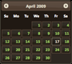
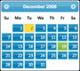
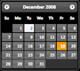
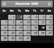

# クライアントタグ

Efwを使って開発するには、いくつかの`.js`ファイルと`.css`ファイルをJSPページにインポートする必要があります。`Client`タグはこのプロセスを簡略化します。

```jsp
...
<%@ taglib prefix="efw" uri="efw" %>
<head>
...
<efw:Client baseurl="/appfolder" mode="jquery-ui" theme="base" lang="en" /> // efw:client または efw:CLIENT
...
</head>
```
## 属性

| 名前 | 必須 | デフォルト | 説明 |
|---|---|---|---|
| `baseurl` | いいえ | `"."` | WebアプリケーションのベースURL。ページがベースフォルダにない場合は必須です。 |
| `mode` | いいえ | `"jquery-ui"` | UIフレームワークを`"jquery-ui"`または`"bootstrap"`に設定します。 |
| `theme` | いいえ | `"base"` | jQuery UIのテーマを設定します。 |
| `major` | いいえ | `"4"` | Bootstrapのメジャーバージョン（2、3、4、または5）を設定します。 |
| `lang` | いいえ | `"en"` | 言語を設定します。言語ファイルは多言語フォルダに配置する必要があります。 |
| `nopromise` | いいえ | `"false"` | ブラウザがJavaScript Promiseをサポートしていない場合は`"true"`に設定します。 |


##### jQuery UI テーマ

| | | | | |
|---|---|---|---|---|
|base|black-tie|blitzer|cupertino|dark-hive|
||||||
|dot-luv|eggplant|excite-bike|flick|hot-sneaks|
!|||||
|humanity|le-frog|mint-choc|overcast|pepper-grinder|
||||||
|redmond|smoothness|south-street|start|sunny|
||||||
|swanky-purse|trontastic|ui-darkness|ui-lightness|vader|
||||||
