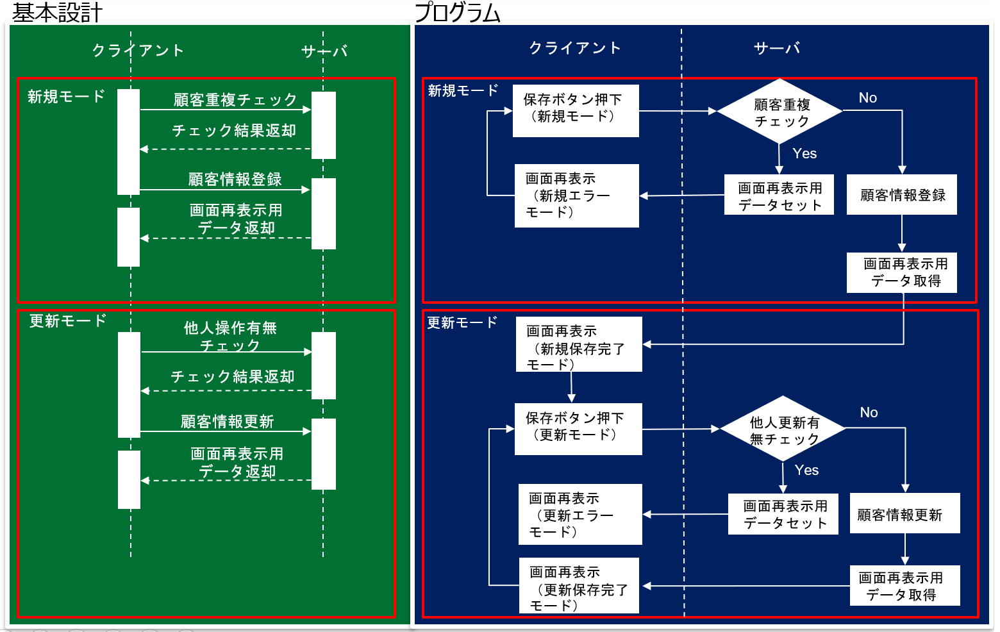
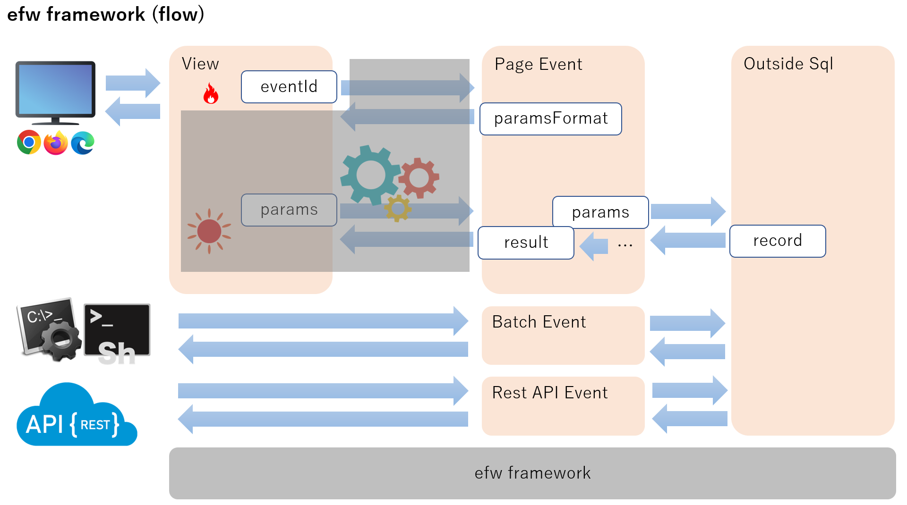
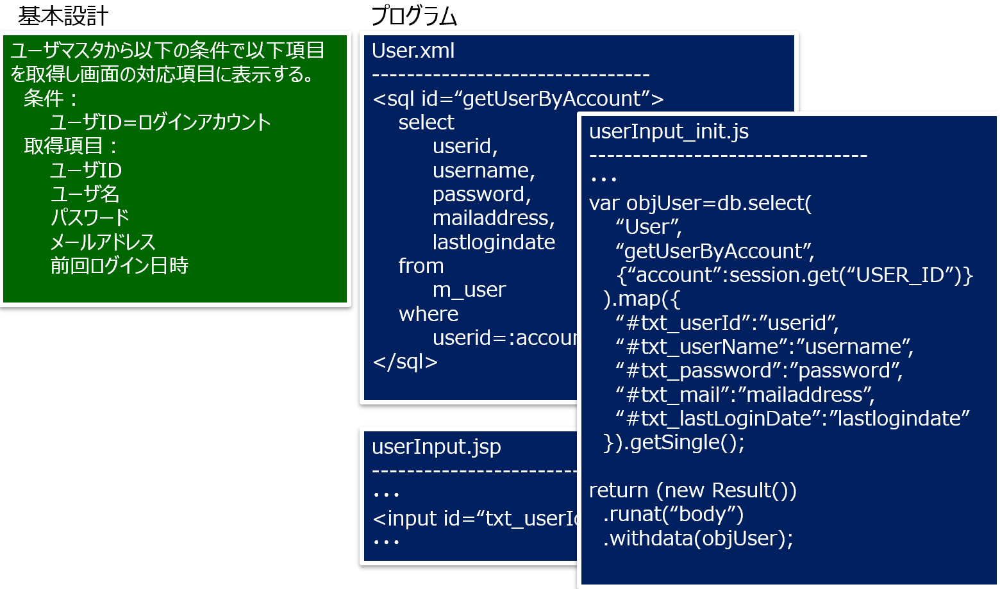
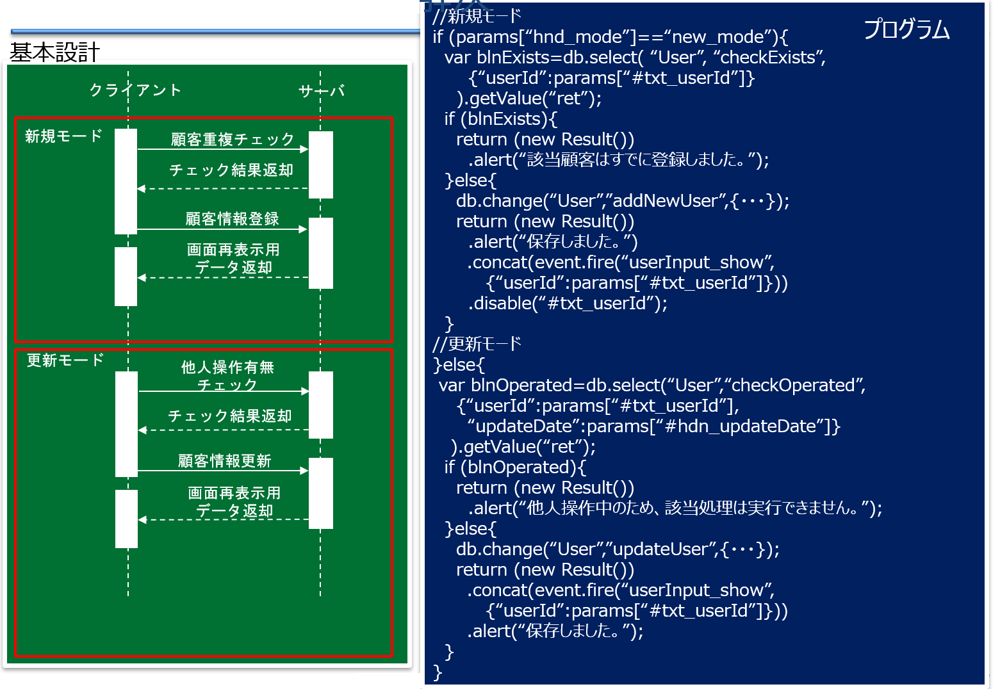

# 【efw紹介】Efwとは

EFW(Escco-Framework)とは、エスコ・ジャパン株式会社が目的指向の手法を用いて設計・開発したサーバサイドJavaScriptのAjaxフレームワークです。EFWを導入することで、WEB開発のプログラム量の大幅削減や、レビュー・仕様変更の迅速な対応が可能になるなど、WEB開発の難易度を下げることができるさまざまな特長があります。JavaのWEB開発に課題を抱えているお客様は、ぜひEFWの利用をご検討ください。

## １、プログラムの可読性
プログラムの可読性とは、プログラムの目的や処理の流れの理解しやすさを指しています。　　(From : wiki/可読性)
プログラムの「理解しやすさ」として以下の２つが考えられます。
- 目的の理解しやすさ
プログラムの粒度は、設計書の粒度とマッピングしやすいか否か
- 処理流れの理解しやすさ
プログラムの記載順番は、設計書の記載順番とマッピングしやすいか否か

そして、従来のWEB開発における問題は以下の通りです。
- 問題１、仕様書の１行に対して、プログラムは数十行で組まないといけない。
- 問題２、仕様書の明瞭な処理順番に対して、プログラムは至る所に遷移するため、プロでないと処理順番をはっきり読み取ることができない。

## ２－１、従来のWEB開発における問題1
以下の図は問題1を表します。基本設計にはわずか１０行ですが、MVC構成のプログラムなら１００行を超えるでしょう。

## ２－２、従来のWEB開発における問題2
以下の図は問題2を表します。従来WEB開発のプログラムの流れは複雑で基本設計と比較すると、まるで別物のようです。

## ３、Efwのスローガン
上記WEB開発の問題を解決するため、Efwは以下の方針を掲げます。
### AjaxとサーバサイトJavaScriptを用いて目的指向で、高速にWEBシステムを構築できます。

ソース公開：
https://github.com/efwGrp/efw4.X
情報処理学会収録論文：
http://id.nii.ac.jp/1001/00147552/

## ４－１、従来問題１の解決
問題1に対して、Efwを用いると以下のようになります。

WEBシステム開発には、「パラメータ受信・入力チェック・ データ表示・活性非活性・表示非表示・画面遷移」などの処理があります。Efwはそれらをパターン化して、WEB画面開発の専用言語(DSL)を設計・実装します。言い換えると「入力データ収集と処理結果表示の自動化」です。

## ４－２、従来問題２の解決
問題2に対して、Efwを用いると以下のようになります。

Efwの仕組みには、クライアント動作やサーバ動作に関係なく、ロジックはほぼ全部イベントJSファイルに集中します。また、「目的指向」のため、プログラムの粒度は設計書の粒度とマッピングしやすいです。そして、イベントJSファイルのみで処理の流れを分かりやすく読み取れます。

## ５、Efwのメリット
Efwのメリットは、以下の図で表します。

