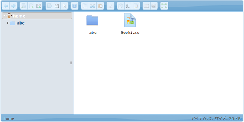

<H1>Efw Tags</H1>

<h2>Client Tag</h2>
To programming with Efw, it is required to import several .js files and .css files into JSP because of JQuery and JQuery UI.
You can use the Efw Tag to make the importing easy.

<pre>
...
&lt;%@ taglib prefix=&quot;efw&quot; uri=&quot;efw&quot; %&gt;
&lt;head&gt;
...
&lt;efw:Client baseurl="/appfolder" /&gt;		//efw:client or efw:CLIENT
...
&lt;/head&gt;
</pre>

<h3>Attributes</h3>
<table>
<tr><th>Name</th><th>Required</th><th>Default</th><th>Description</th></tr>
<tr><td>baseurl</td><td>No</td><td>"."</td><td>The web application base url. If your page is not in the base folder, it is must.</td></tr>
</table>

<h2>Part Tag</h2>
It will be more easy using Part tag to include a common page part made by JSP in your own JSP.
<pre>
&lt;%@ taglib prefix=&quot;efw&quot; uri=&quot;efw&quot; %&gt;
&lt;body&gt;
...
&lt;efw:Part path="part.jsp" param1="####" param2="####" /&gt;		//or efw:part , efw:PART
...
&lt;/body&gt;
</pre>

You can get the params in the part jsp by request.getAttribute like the next.

<pre>
<%=request.getAttribute("param1")%>
<%=request.getAttribute("param2")%>
</pre>

<H1>Addition Tags</H1>

<h2>elFinder Tag</h2>
ElFinder is a famous file manager for web. We made a customized version from <a href="https://studio-42.github.io/elFinder/">elFinder 2.1</a>,
and included it into Efw as a tag. It must be used after the Client tag for jQuery and jQuery UI including. 

<pre>
&lt;%@ taglib prefix=&quot;efw&quot; uri=&quot;efw&quot; %&gt;
&lt;head&gt;
	&lt;efw:Client/&gt;
&lt;/head&gt;
&lt;body&gt;
	&lt;efw:elFinder id="elFinder1" home="homefolder" height="400" width="800" lang="en" readonly="false" /&gt; //or efw:elfinder , efw:Elfinder , efw:ELFINDER
&lt;/body&gt;
</pre>
<h3>Attributes</h3>
<table>
<tr><th>Name</th><th>Required</th><th>Default</th><th>Description</th></tr>
<tr><td>id</td><td>Yes</td><td></td><td>The identity of the elFinder tag. You can use it as the instance of the elFinder.</td></tr>
<tr><td>home</td><td>No</td><td>""</td><td>A relative path to the storage folder(/WEB-INF/storage). You can set <a href="properties_web.md">the properties file</a> to change the storage folder to your own folder.</td></tr>
<tr><td>height</td><td>No</td><td>"400"</td><td>The height of elFinder tag. The unit is "px".</td></tr>
<tr><td>width</td><td>No</td><td>"auto"</td><td>The width of elFinder tag. The unit is "px". </td></tr>
<tr><td>lang</td><td>No</td><td>"en"</td><td>The language of elFinder tag.</td></tr>
<tr><td>readonly</td><td>No</td><td>"false"</td><td>The elFinder tag is for reference or not. </td></tr>
<tr><td>protected</td><td>No</td><td>"false"</td><td>The elFinder tag is protected or not. If it is true, "setHome" method and "setReadOnly" method calling will be ignored.</td></tr>

</table>
<h3>Methods</h3>
<table>
<tr><th>Calling</th><th>Returning</th><th>Description</th></tr>
<tr><td>id . setHome ( path )</td><td>void</td><td>To set the home attribute.</td></tr>
<tr><td>id . setHeight ( height ) </td><td>void</td><td>To set the height attribute.</td></tr>
<tr><td>id . setWidth ( width ) </td><td>void</td><td>To set the width attribute.</td></tr>
<tr><td>id . setReadOnly ( readonly ) </td><td>void</td><td>To set the readonly attribute.</td></tr>
</table>

<h2>Signature Tag</h2>
JQuery UI Signature is a famous handwritten sign tool for web.We made a customized version from <a href="http://keith-wood.name/signature.html">jQuery UI Signature 1.1.2</a>,
and included it into Efw as a tag. It must be used after the Client tag for jQuery and jQuery UI including. 

<pre>
&lt;%@ taglib prefix=&quot;efw&quot; uri=&quot;efw&quot; %&gt;
&lt;head&gt;
	&lt;efw:Client/&gt;
&lt;/head&gt;
&lt;body&gt;
	&lt;efw:Signature id="signature1" width="400" height="200" /&gt; //or efw:signature , efw:SIGNATURE 
&lt;/body&gt;
</pre>

<h3>Attributes</h3>
<table>
<tr><th>Name</th><th>Required</th><th>Default</th><th>Description</th></tr>
<tr><td>id</td><td>Yes</td><td></td><td>The identity of the Signature tag. </td></tr>
<tr><td>height</td><td>No</td><td>"200"</td><td>The height of Signature tag. The unit is "px".</td></tr>
<tr><td>width</td><td>No</td><td>"400"</td><td>The width of Signature tag. The unit is "px". </td></tr>
</table>

A hidden input with the id same to the signature tag will be created to contain the image data.
<pre>
	var data = $("#signature1").val();
</pre>

<h2>CKEditor Tag</h2>
CKEditor is a famous rich text editor for web. We made a customized version from <a href="http://ckeditor.com/">CKEditor 4.6.2</a>,
and included it into Efw as a tag. It must be used after the Client tag for jQuery and jQuery UI including. 

<pre>
&lt;%@ taglib prefix=&quot;efw&quot; uri=&quot;efw&quot; %&gt;
&lt;head&gt;
	&lt;efw:Client/&gt;
&lt;/head&gt;
&lt;body&gt;
	&lt;efw:CKEditor id="ckeditor1" width="800" height="300" readonly="false" lang="ja" pattern="standard" /&gt; //or efw:ckeditor , efw:CKeditor , efw:Ckeditor , efw:ckEditor
&lt;/body&gt;
</pre>

<h3>Attributes</h3>
<table>
<tr><th>Name</th><th>Required</th><th>Default</th><th>Description</th></tr>
<tr><td>id</td><td>Yes</td><td></td><td>The identity of the CKEditor tag. </td></tr>
<tr><td>pattern</td><td>No</td><td>"standard"</td><td>The pattern of the CKEditor tag. [ basic | standard | full ]. </td></tr>
<tr><td>height</td><td>No</td><td>"400"</td><td>The height of CKEditor tag. The unit is "px".</td></tr>
<tr><td>width</td><td>No</td><td>"auto"</td><td>The width of CKEditor tag. The unit is "px". </td></tr>
<tr><td>lang</td><td>No</td><td>""</td><td>The language of CKEditor tag. It will detect the language automatically by default.</td></tr>
<tr><td>readonly</td><td>No</td><td>"false"</td><td>The CKEditor tag is for reference or not. </td></tr>
</table>

<h3>Methods</h3>
<table>
<tr><th>Calling</th><th>Returning</th><th>Description</th></tr>
<tr><td>id . setPattern ( path )</td><td>void</td><td>To set the pattern attribute.</td></tr>
<tr><td>id . setHeight ( height ) </td><td>void</td><td>To set the height attribute.</td></tr>
<tr><td>id . setWidth ( width ) </td><td>void</td><td>To set the width attribute.</td></tr>
<tr><td>id . setReadOnly ( readonly ) </td><td>void</td><td>To set the readonly attribute.</td></tr>
</table>

A hidden input with the id same to the CKEditor tag will be created to contain the CKEditor data.
<pre>
	var data = $("#ckeditor1").val();
</pre>

<h2>Chart Tag</h2>
<a href="https://developers.google.com/chart/">Google charts API</a> is a famous html5 chart tool for web. We made several templates to use it more easier,
and included them into Efw as a tag. It must be used after the Client tag for jQuery and jQuery UI including. 

<pre>
&lt;%@ taglib prefix=&quot;efw&quot; uri=&quot;efw&quot; %&gt;
&lt;head&gt;
	&lt;efw:Client/&gt;
	&lt;script&gt;
		function func1(options){
			//alert(JSON.stringify(options));//to show the options as string.
			options.options.vAxis.ticks=[100,1000000];// it will be preferential to param data-ticks
		}
	&lt;/script&gt;
&lt;/head&gt;
&lt;body&gt;
	&lt;efw:Chart id="char1" data="chart1_data" type="column" width="400" height="250" version="45.2" setoptions="func1" /&gt; //or efw:chart , efw:CHART

	&lt;table border=1 id="chart1_data" data-format="#,##0百万円" data-legend="bottom" data-ticks="100,1000000">
	&lt;caption>会社業績&lt;/caption>
		&lt;tr>&lt;th>年度&lt;/th>&lt;th data-color="red">売上高&lt;/th>&lt;th  data-color="green">営業利益&lt;/th>&lt;th data-color="blue">経常利益&lt;/th>&lt;/tr>
		&lt;tr>&lt;td>2004 年&lt;/td>&lt;td>1,000百万円&lt;/td>&lt;td>400百万円&lt;/td>&lt;td>380百万円&lt;/td>&lt;/tr>
	...
	&lt;/table>
&lt;/body&gt;

</pre>

<h3>Attributes</h3>
<table>
<tr><th>Name</th><th>Required</th><th>Default</th><th>Description</th></tr>
<tr><td>id</td><td>Yes</td><td></td><td>The identity of the Chart tag. </td></tr>
<tr><td>data</td><td>Yes</td><td></td><td>The id of a data table to the Chart tag. </td></tr>
<tr><td>type</td><td>Yes</td><td></td><td>The type of the Chart tag. [ column | stackedcolumn | line | pie | donut | bar | stackedbar | area | stackedarea | scatter ]. </td></tr>
<tr><td>height</td><td>No</td><td>"400"</td><td>The height of Chart tag. The unit is "px".</td></tr>
<tr><td>width</td><td>No</td><td>"auto"</td><td>The width of Chart tag. The unit is "px". </td></tr>
<tr><td>version</td><td>No</td><td>"current"</td><td>The version of Google Chart.</td></tr>
<tr><td>setoptions</td><td>No</td><td></td><td>The name of the customize function to set option params for google chart.</td></tr>

<tr><td>data-format</td><td>No</td><td></td><td>The format of the data.If it is defined, the tooltip of the data will be formated. </td></tr>
<tr><td>data-legend</td><td>No</td><td></td><td>The position of the legend.[ none | left | right | top | bottom ] </td></tr>
<tr><td>data-color</td><td>No</td><td></td><td>The color of the item. To set it with RGB or color name. </td></tr>
<tr><td>data-ticks</td><td>No</td><td></td><td>The gradations of the chart.</td></tr>

</table>

<h3>Methods</h3>
<table>
<tr><th>Calling</th><th>Returning</th><th>Description</th></tr>
<tr><td>id . draw ( )</td><td>void</td><td>To draw the chart again.</td></tr>
<tr><td>id . setType ( type )</td><td>void</td><td>To set the type attribute.</td></tr>
<tr><td>id . setHeight ( height ) </td><td>void</td><td>To set the height attribute.</td></tr>
<tr><td>id . setWidth ( width ) </td><td>void</td><td>To set the width attribute.</td></tr>
</table>