# To Draw Barcode

To draw barcodes in HTML, you can use `drawServlet`. It is mostly based on [barcode4j](http://barcode4j.sourceforge.net/), with the exception of QR Codes, which are powered by [ZXing](https://github.com/zxing/zxing).

## Sample for JSP

```html

```

## API

| Type | Description |
|---|---|
| `qrcode` | QR Code 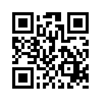 |
| `codabar` | Codabar 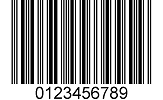 |
| `code39` | Code 39 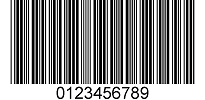 |
| `code128` | Code 128 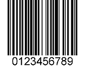 |
| `2of5` | Interleaved 2 of 5 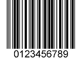 |
| `itf14` | ITF-14 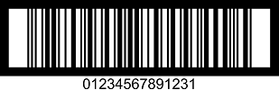 |
| `ean13` | EAN-13 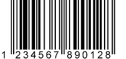 |
| `ean8` | EAN-8 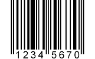 |
| `upca` | UPC-A 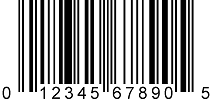 |
| `upce` | UPC-E 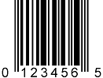 |
| `postnet` | POSTNET  |
| `rmcbc` | Royal Mail Customer Barcode 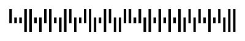 |
| `usps4cb` | USPS Intelligent Mail  |
| `pdf417` | PDF417  |
| `datamatrix` | DataMatrix  |