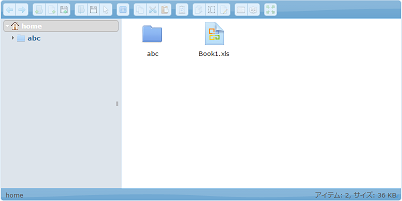

# elFinder Tag

elFinder is a popular web file manager. We've created a customized version based on [elFinder 2.1](https://studio-42.github.io/elFinder/) and included it in Efw as a tag. It must be used after the `Client` tag, which includes jQuery and jQuery UI. To protect system files like `Thumb.db`, all hidden files are not shown.



```jsp
<%@ taglib prefix="efw" uri="efw" %>
<head>
  <efw:Client/>
</head>
<body>
  <efw:elFinder id="elFinder1" home="homefolder" height="400" width="800" readonly="false" /> // or efw:elfinder, efw:Elfinder, efw:ELFINDER
</body>
```

## Attributes

| Name | Required | Default | Description |
|---|---|---|---|
| `id` | Yes |  | The ID of the elFinder tag. You can use it to access the elFinder instance. |
| `home` | No | `""` | A relative path to the storage folder (`/WEB-INF/storage`). You can configure the storage folder by modifying [the properties file](properties.web.md). |
| `selection` | No | `""` | A relative path to the home folder. The file or folder at this path will be selected when elFinder opens. |
| `height` | No | `"400"` | The height of the elFinder tag in pixels. |
| `width` | No | `"auto"` | The width of the elFinder tag in pixels. |
| `readonly` | No | `"false"` | Specifies whether the elFinder tag is read-only. |
| `protected` | No | `"false"` | Specifies whether the elFinder tag is protected. If `true`, calls to the `setHome` and `setReadOnly` methods will be ignored. |
| `isAbs` | No | `false` | Specifies whether the `home` path is an absolute path. |

## Methods

| Calling | Returning | Description |
|---|---|---|
| `elfinder. setHome ( path )` | `void` | Sets the `home` attribute. |
| `elfinder. setHome ( path, selection )` | `void` | Sets the `home` and `selection` attributes. |
| `elfinder. setHeight ( height )` | `void` | Sets the `height` attribute. |
| `elfinder. setWidth ( width )` | `void` | Sets the `width` attribute. |
| `elfinder. setReadOnly ( readonly )` | `void` | Sets the `readonly` attribute. |