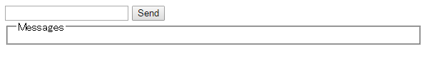
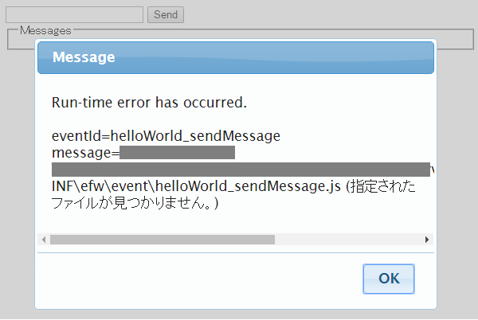
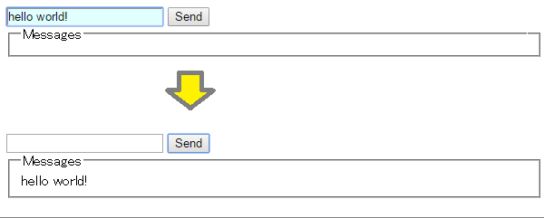
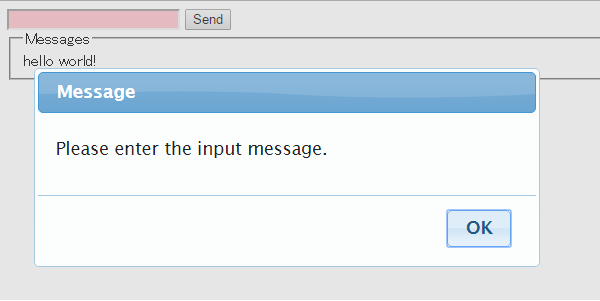

<H1>Quick Start with "Hello World"</H1>

With Efw,it is easily to start web programming if you know Javascript & JQuery.

<h2>JSP</h2>
Create a file with the next codes, and name it as "helloworld.jsp" in your web application folder "efw".
<pre>
&lt;%@ page language=&quot;java&quot; contentType=&quot;text/html; charset=UTF-8&quot; pageEncoding=&quot;UTF-8&quot;%&gt;
<b>&lt;%@ taglib prefix=&quot;efw&quot; uri=&quot;efw&quot; %&gt;</b>
&lt;html&gt;
&lt;head&gt;
	&lt;meta http-equiv=&quot;Content-Type&quot; content=&quot;text/html; charset=UTF-8&quot;&gt;
	&lt;title&gt;Hello World&lt;/title&gt;
	<b>&lt;efw:Client/&gt;</b>
&lt;/head&gt;
&lt;body&gt;
	&lt;input type=text <b>id=&quot;txtMessage&quot;</b>&gt;
	&lt;input type=button value=&quot;Send&quot; <b>onclick="Efw('helloWorld_sendMessage')"</b>&gt;
	&lt;fieldset&gt;&lt;legend&gt;Messages&lt;/legend&gt;&lt;/fieldset&gt;
&lt;/body&gt;
</pre>

You will see the next image, if you call it from a web browser by the url http://localhost:8080/efw/helloworld.jsp . 
 

you will see an error, if you click the "Send" button before you complete the next step. 
 

<h2>Server Event</h2>
Create a file with the next codes, and name it as "helloWorld_sendMessage.js" in the server event folder "efw/WEB-INF/efw/event/".
<pre>
var helloWorld_sendMessage={};
helloWorld_sendMessage.paramsFormat={
		&quot;#txtMessage&quot;:&quot;required:true;display-name:the input message&quot;
};
helloWorld_sendMessage.fire=function(params){
	return (new Result())
		.runat(&quot;body&quot;)
		.withdata({&quot;#txtMessage&quot;:&quot;&quot;})
		.runat(&quot;fieldset&quot;)
		.append(&quot;&lt;span&gt;{message}&lt;br&gt;&lt;/span&gt;&quot;)
		.withdata([{&quot;message&quot;:params[&quot;#txtMessage&quot;]}]);
};
</pre>
The entering in the input messsage will be moved into the messsages, after you click the "Send" button. 
 

You will see an alert and a hightlight, if you click the "Send" button without entering. 
 
