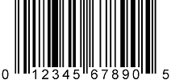

<H1>To Draw Barcode</H1>

To draw barcode in html, you can use drawServlet.
It is almost based on <a href="http://barcode4j.sourceforge.net/">barcode4j</a> except QR Code
which is powered by <a href="https://github.com/zxing/zxing">ZXing</a>.
<h2>Sample for JSP</h2>

```html

```

<h2>API</h2>
<table>
	<tr><th>Type</th><th>Description</th></tr>
	<tr><td>qrcode</td><td>QR Code</td><td></td></tr>
	<tr><td>codabar</td><td>Codabar</td><td></td></tr>
	<tr><td>code39</td><td>Code 39</td><td></td></tr>
	<tr><td>code128</td><td>Code 128</td><td></td></tr>
	<tr><td>2of5</td><td>Interleaved 2 of 5</td><td></td></tr>
	<tr><td>itf14</td><td>ITF-14</td><td></td></tr>
	<tr><td>ean13</td><td>EAN-13</td><td></td></tr>
	<tr><td>ean8</td><td>EAN-8</td><td></td></tr>
	<tr><td>upca</td><td>UPC-A</td><td></td></tr>
	<tr><td>upce</td><td>UPC-E</td><td></td></tr>
	<tr><td>postnet</td><td>POSTNET</td><td></td></tr>
	<tr><td>rmcbc</td><td>Royal Mail Customer Barcode</td><td></td></tr>
	<tr><td>usps4cb</td><td>USPS Intelligent Mail</td><td></td></tr>
	<tr><td>pdf417</td><td>PDF417</td><td></td></tr>
	<tr><td>datamatrix</td><td>DataMatrix</td><td></td></tr>
</table>
