<h1>Chart Tag</h1>
<a href="https://developers.google.com/chart/">Google charts</a> and <a href="https://www.chartjs.org/">Chart.js</a> are famous html5 chart tools for web. We made several templates to use it more easier,
and included them into Efw as a tag. It must be used after the Client tag for jQuery and jQuery UI including. 

<pre>
&lt;%@ taglib prefix=&quot;efw&quot; uri=&quot;efw&quot; %&gt;
&lt;head&gt;
	&lt;efw:Client/&gt;
	&lt;script&gt;
		function func1(options){
			//alert(JSON.stringify(options));//to show the options as string.
			options.options.vAxis.ticks=[100,1000000];// it will be preferential to param data-ticks
		}
	&lt;/script&gt;
&lt;/head&gt;
&lt;body&gt;
	&lt;efw:Chart id="char1" data="chart1_data" type="column" width="400" height="250" version="45.2" setoptions="func1" /&gt; //or efw:chart , efw:CHART

	&lt;table border=1 id="chart1_data" data-format="#,##0百万円" data-legend="bottom" data-ticks="100,1000000">
	&lt;caption>会社業績&lt;/caption>
		&lt;tr>&lt;th>年度&lt;/th>&lt;th data-color="red">売上高&lt;/th>&lt;th  data-color="green">営業利益&lt;/th>&lt;th data-color="blue">経常利益&lt;/th>&lt;/tr>
		&lt;tr>&lt;td>2004 年&lt;/td>&lt;td>1,000百万円&lt;/td>&lt;td>400百万円&lt;/td>&lt;td>380百万円&lt;/td>&lt;/tr>
	...
	&lt;/table>
&lt;/body&gt;

</pre>

<h2>Attributes</h2>
<table>
<tr><th>Name</th><th>Required</th><th>Default</th><th>Description</th></tr>
<tr><td>id</td><td>Yes</td><td></td><td>The identity of the Chart tag. </td></tr>
<tr><td>mode</td><td>No</td><td>"googlechart"</td><td>To set the designing mode to "googlechart" or "chartjs". </td></tr>
<tr><td>data</td><td>Yes</td><td></td><td>The id of a data table to the Chart tag. </td></tr>
<tr><td>type</td><td>Yes</td><td></td><td>The type of the Chart tag. </td></tr>
<tr><td colspan="4">
googlechart:
	<table>
		<tr>
			<th>column 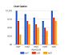</th>
			<th>stackedcolumn 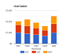</th>
			<th>line 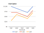</th>
			<th>pie 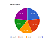</th>
			<th>donut 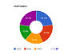</th>
		</tr>
		<tr>
			<th>bar 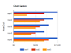</th>
			<th>stackedarea 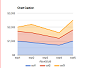</th>
			<th>area 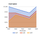</th>
			<th>stackedarea </th>
			<th>scatter 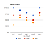</th>
		</tr>
	</table>
chartjs:
	<table>
		<tr>
			<th>column</th>
			<td>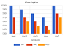</td>
			<th>stackedcolumn</th>
			<td>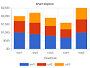</td>
			<th>line</th>
			<td>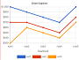</td>
			<th>pie</th>
			<td></td>
			<th>donut</th>
			<td></td>
		</tr>
		<tr>
			<th>bar</th>
			<td>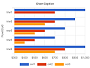</td>
			<th>stackedarea</th>
			<td>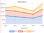</td>
			<th>area</th>
			<td></td>
			<th>stackedarea</th>
			<td></td>
			<th>scatter</th>
			<td>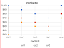</td>
		</tr>
		<tr>
			<th>radar</th>
			<td>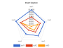</td>
		</tr>
	</table>

</td></tr>
<tr><td>height</td><td>No</td><td>"400"</td><td>The height of Chart tag. The unit is "px".</td></tr>
<tr><td>width</td><td>No</td><td>"auto"</td><td>The width of Chart tag. The unit is "px". </td></tr>
<tr><td>version</td><td>No</td><td>"current"</td><td>The version of Google Chart.</td></tr>
<tr><td>setoptions</td><td>No</td><td></td><td>The name of the customize function to set option params for google chart.</td></tr>

<tr><td>data-format</td><td>No</td><td></td><td>The format of the data.If it is defined, the tooltip of the data will be formated. </td></tr>
<tr><td>data-legend</td><td>No</td><td></td><td>The position of the legend.[ none | left | right | top | bottom ] </td></tr>
<tr><td>data-color</td><td>No</td><td></td><td>The color of items. To set it with RGB or color name in row titles or col titles. </td></tr>
<tr><td colspan=4>
	<table>
		<tr>
			<td>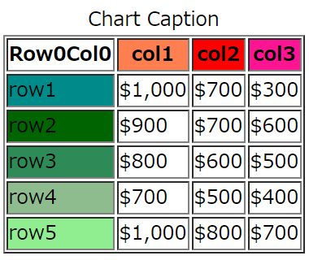</td>
			<td>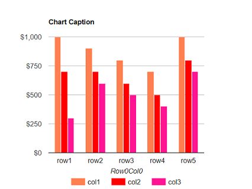</td>
			<td>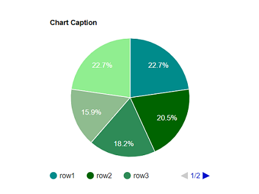</td>
		</tr>
	</table>
</td></tr>
<tr><td>data-ticks</td><td>No</td><td></td><td>The gradations of the chart.</td></tr>
</table>

<h2>Methods</h2>
<table>
<tr><th>Calling</th><th>Returning</th><th>Description</th></tr>
<tr><td>id . draw ( )</td><td>void</td><td>To draw the chart again.</td></tr>
<tr><td>id . setType ( type )</td><td>void</td><td>To set the type attribute.</td></tr>
<tr><td>id . setHeight ( height ) </td><td>void</td><td>To set the height attribute.</td></tr>
<tr><td>id . setWidth ( width ) </td><td>void</td><td>To set the width attribute.</td></tr>
</table>