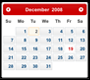
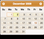

<H1>Client Tag</H1>
To programming with Efw, it is required to import several .js files and .css files into JSP.
You can use the Efw Tag to make the importing easy.

<pre>
...
&lt;%@ taglib prefix=&quot;efw&quot; uri=&quot;efw&quot; %&gt;
&lt;head&gt;
...
&lt;efw:Client baseurl="/appfolder" mode="jquery-ui" theme="base" lang="en" /&gt;		//efw:client or efw:CLIENT
...
&lt;/head&gt;
</pre>

<h2>Attributes</h2>
<table>
<tr><th>Name</th><th>Required</th><th>Default</th><th>Description</th></tr>
<tr><td>baseurl</td><td>No</td><td>"."</td><td>The web application base url. If your page is not in the base folder, it is must.</td></tr>
<tr><td>mode</td><td>No</td><td>"jquery-ui"</td><td>To set the designing mode to "jquery-ui" or "bootstrap".</td></tr>
<tr><td>theme</td><td>No</td><td>"base"</td><td>To set the theme for "jquery-ui".</td></tr>
<tr><td colspan=4>
	<table>
	<tr>
		<td>base</td><td></td>
		<td>black-tie</td><td></td>
		<td>blitzer</td><td></td>
		<td>cupertino</td><td></td>
		<td>dark-hive</td><td></td>
	</tr>
	<tr>
		<td>dot-luv</td><td></td>
		<td>eggplant</td><td></td>
		<td>excite-bike</td><td></td>
		<td>flick</td><td></td>
		<td>hot-sneaks</td><td></td>
	</tr>
	<tr>
		<td>humanity</td><td></td>
		<td>le-frog</td><td></td>
		<td>mint-choc</td><td></td>
		<td>overcast</td><td></td>
		<td>pepper-grinder</td><td></td>
	</tr>
	<tr>
		<td>redmond</td><td></td>
		<td>smoothness</td><td></td>
		<td>south-street</td><td></td>
		<td>start</td><td></td>
		<td>sunny</td><td></td>
	</tr>
	<tr>
		<td>swanky-purse</td><td></td>
		<td>trontastic</td><td></td>
		<td>ui-darkness</td><td></td>
		<td>ui-lightness</td><td></td>
		<td>vader</td><td></td>
	</tr>
	</table>
</td></tr>
<tr><td>lang</td><td>No</td><td>"en"</td><td>To set the language, which is prepared in the multi language folder as a resource file.</td></tr>
</table>

