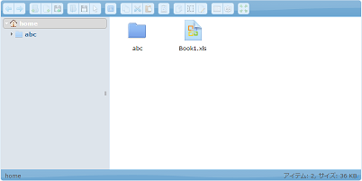

<h1>elFinder Tag</h1>
ElFinder is a famous file manager for web. We made a customized version from <a href="https://studio-42.github.io/elFinder/">elFinder 2.1</a>,
and included it into Efw as a tag. It must be used after the Client tag for jQuery and jQuery UI including. For protecting system files just like Thumb.db, all hidden files will not been shown. 

<pre>
&lt;%@ taglib prefix=&quot;efw&quot; uri=&quot;efw&quot; %&gt;
&lt;head&gt;
	&lt;efw:Client/&gt;
&lt;/head&gt;
&lt;body&gt;
	&lt;efw:elFinder id="elFinder1" home="homefolder" height="400" width="800" lang="en" readonly="false" /&gt; //or efw:elfinder , efw:Elfinder , efw:ELFINDER
&lt;/body&gt;
</pre>
<h2>Attributes</h2>
<table>
<tr><th>Name</th><th>Required</th><th>Default</th><th>Description</th></tr>
<tr><td>id</td><td>Yes</td><td></td><td>The identity of the elFinder tag. You can use it as the instance of the elFinder.</td></tr>
<tr><td>home</td><td>No</td><td>""</td><td>A relative path to the storage folder(/WEB-INF/storage). You can set <a href="properties.web.md">the properties file</a> to change the storage folder to your own folder.</td></tr>
<tr><td>selection</td><td>No</td><td>""</td><td>A relative path to the home folder. The file or folder of the path will be selected when elfinder openning .</td></tr>
<tr><td>height</td><td>No</td><td>"400"</td><td>The height of elFinder tag. The unit is "px".</td></tr>
<tr><td>width</td><td>No</td><td>"auto"</td><td>The width of elFinder tag. The unit is "px". </td></tr>
<tr><td>lang</td><td>No</td><td>"en"</td><td>The language of elFinder tag.</td></tr>
<tr><td>readonly</td><td>No</td><td>"false"</td><td>The elFinder tag is for reference or not. </td></tr>
<tr><td>protected</td><td>No</td><td>"false"</td><td>The elFinder tag is protected or not. If it is true, "setHome" method and "setReadOnly" method calling will be ignored.</td></tr>
<tr><td>isAbs</td><td>No</td><td>false</td><td>The home path is absolute path or not.</td></tr>
</table>
<h2>Methods</h2>
<table>
<tr><th>Calling</th><th>Returning</th><th>Description</th></tr>
<tr><td>id . setHome ( path )</td><td>void</td><td>To set the home attribute.</td></tr>
<tr><td>id . setHome ( path , selection )</td><td>void</td><td>To set the home attribute and the selection attribute.</td></tr>
<tr><td>id . setHeight ( height ) </td><td>void</td><td>To set the height attribute.</td></tr>
<tr><td>id . setWidth ( width ) </td><td>void</td><td>To set the width attribute.</td></tr>
<tr><td>id . setReadOnly ( readonly ) </td><td>void</td><td>To set the readonly attribute.</td></tr>
</table>
